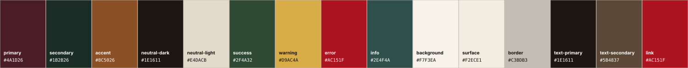
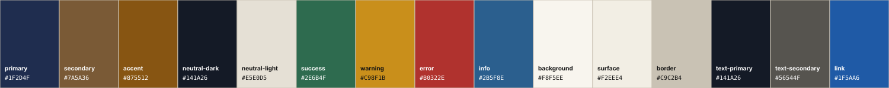
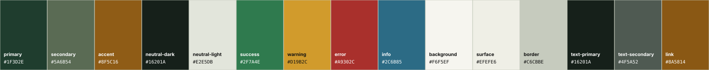
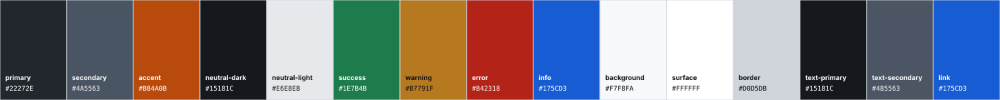
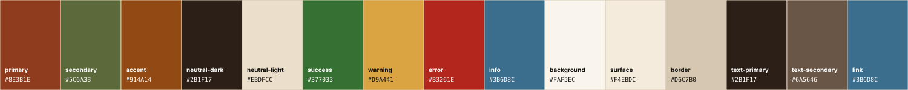
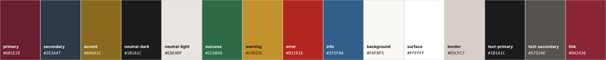
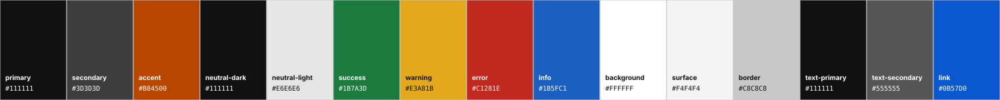

# Warianty palety kolorystycznej v2 - siedem kierunków do wyboru

**Status: propozycja. Żaden z siedmiu wariantów nie jest finalny. Obowiązująca paleta 12 barw w `/03-pakiet-claude-design/format-paczki.md` pozostaje bez zmian, dopóki founder nie wskaże numeru wariantu.** Wcześniejsza decyzja o zatwierdzeniu palety (`/PLAN.md`, sekcja „Decyzje foundera - rozstrzygnięte”) nie jest tu kasowana - ten dokument dodaje proces wyboru, nie zastępuje historii.

Powiązane pliki:

- podgląd wizualny: [`palette-preview-v2.html`](./palette-preview-v2.html) (otwierać lokalnie, wymaga internetu dla Google Fonts) i jego opis [`palette-preview-v2.md`](./palette-preview-v2.md),
- dane: [`tokens/palette-options-v2.json`](./tokens/palette-options-v2.json),
- pełny pomiar kontrastu: [`podglad/kontrast-pomiar.md`](./podglad/kontrast-pomiar.md),
- generator (jedyne źródło liczb w tym pliku): [`narzedzia/generuj-podglad-i-kontrast.py`](./narzedzia/generuj-podglad-i-kontrast.py).

## 1. Co zostało wykryte w repozytorium - typografia i style (bez zmian)

Jedynym plikiem w repozytorium, który definiuje styl wizualny, jest `brandbook.dc.html` (wstępne canvas foundera). Z niego, nie z pamięci, pochodzi typografia użyta w podglądzie:

| Element | Wartość w `brandbook.dc.html` | Gdzie w pliku |
|---|---|---|
| Krój podstawowy | Manrope, wagi 200-800, ładowany z Google Fonts | `helmet`, `<link href="https://fonts.googleapis.com/css2?family=Manrope:wght@200..800&family=Inconsolata:wght@300..700...">` |
| Krój pomocniczy | Inconsolata 300-700 - kody, hex, metadane | tamże; użycia w § 02-§ 05 |
| Display (D) | 200 · 72 px · interlinia 0,92 · tracking -0,03 em | § 04, tabela skali |
| H1 (rozdział) | 300 · 40 px · interlinia 1,0 · tracking -0,02 em | § 04 |
| H2 (sekcja) | 600 · 24 px · interlinia 1,1 · tracking -0,01 em | § 04 |
| Drogowskaz / kicker (K) | 700 · 9,5-10,5 px · wersaliki · tracking 0,2-0,26 em | § 04 oraz tytuły boxów w § 02 (pełni rolę H3) |
| Lead (B+) | 500 · 16 px · interlinia 1,4 | § 04 |
| Korpus (B) | 400 · 13,5 px · interlinia 1,55 | § 04 |
| Przypis (B-) | 400 · 10 px · interlinia 1,5, kolor tekstu pomocniczego | § 04 |
| Liczba prowadząca (N) | 800 · 52 px · tabular · tracking -0,02 em | § 04 |
| Link | podkreślenie, odsunięcie 2 px, zmiana koloru po najechaniu | `helmet`, reguła `a` |
| Sekcja / karta | tło karty, obrys 1 px w kolorze tuszu, padding 48 px | każda `<section>` |
| Tabela | wiersze rozdzielone liniami 1 px (pełny tusz i hairline), nagłówki w stylu drogowskazu | § 02 „Minimalna wielkość”, § 04 skala |
| Pas tytułowy | tło w kolorze tuszu, logotyp odwrócony filtrem, pięć pasków akcentu | § 00 okładka |

`brandbook.dc.html` nie ma poziomu H3 nazwanego wprost; jego rolę pełni drogowskaz (tytuły boxów w § 02) i tak jest odwzorowany w podglądzie. Canvas nie ma też przycisków (dokument drukowany) - CTA w podglądzie używa stylu drogowskazu (700, wersaliki, tracking 0,16 em) na prostokątnym tle, bez zaokrągleń, żeby nie wprowadzać nowego języka typograficznego.

**Sprzeczność źródeł, rozstrzygnięta:** `_robocze/copilot-v1/identity/typography-system.md` opisuje inną skalę (H1 48 px / waga 600, korpus 16 px). Zgodnie z `/CLAUDE.md` katalog `_robocze/` nie jest źródłem prawdy bez ponownej weryfikacji, a `format-paczki.md` przyjmuje typografię z canvasu - dlatego podgląd używa skali z `brandbook.dc.html`, a plik z `_robocze/` jest tu tylko odnotowany.

**Tokeny:** repozytorium nie miało dotąd żadnego pliku tokenów (json / yaml / css). Plik `tokens/palette-options-v2.json` powstał pomocniczo jako struktura danych siedmiu wariantów i wejście generatora - nie jest obowiązującą specyfikacją.

## 2. Zasady wspólne dla siedmiu wariantów

- **Identyczny zestaw 15 tokenów** w każdym wariancie: `primary`, `secondary`, `accent`, `neutral-dark`, `neutral-light`, `success`, `warning`, `error`, `info`, `background`, `surface`, `border`, `text-primary`, `text-secondary`, `link`. Nazwy są identyfikatorami technicznymi (wymóg zlecenia), stąd po angielsku.
- **Mapowanie dziedzin** (Pedagogika / Akademia AI / Pożyczki UE/BGK) nie mieści się w 15 tokenach, więc przy każdym wariancie jest podane osobno jako propozycja, żeby reguła 80/15/5 z `format-paczki.md` dała się utrzymać.
- **Typografia bez zmian.** Jedyną zmienną między wariantami są wartości tokenów i ich przypisanie do elementów. Ten sam układ, ten sam krój, te same wagi i rozmiary.
- **Warning nigdy nie jest kolorem tekstu.** Żółcie i ochry nie osiągają 4,5:1 na jasnym tle w żadnym wariancie; warning działa wyłącznie jako tło etykiety (z ciemnym tekstem) albo linia. To jedna z dwóch par oznaczonych ⚠ we wszystkich siedmiu wariantach - zamierzona, nie przeoczona.
- **Border jest hairline’em dekoracyjnym** (odpowiednik linii `rgba(30,22,17,0.22)` z canvasu) i nie spełnia progu 3:1 dla elementów nietekstowych. Tam, gdzie linia niesie znaczenie (ramka pola formularza, granica komponentu), należy użyć `neutral-dark`, tak jak robi to canvas przy obrysach sekcji. To druga zamierzona para ⚠.

## 3. Metodologia pomiaru kontrastu

Kontrast liczony wzorem WCAG 2.1 na luminancję względną sRGB, skryptem `narzedzia/generuj-podglad-i-kontrast.py`, na wartościach z `tokens/palette-options-v2.json`. Progi: AA tekst normalny 4,5:1; AA duży tekst (H1, H2 w rozmiarach z § 04) 3:1; AAA 7:1; elementy nietekstowe 3:1. Znak ⚠ oznacza wynik poniżej progu wymaganego dla danej pary. Tabele w sekcjach 4.1-4.7 są wstrzykiwane przez generator między znaczniki HTML - ręczna edycja liczb zostanie nadpisana przy następnym uruchomieniu, co jest zamierzone. Falsyfikator każdej liczby: uruchomić skrypt ponownie albo wstawić dwa kolory do dowolnego kalkulatora WCAG.

Pomiar dotyczy ekranu (sRGB). Dla druku offsetowego i kserokopii liczby są tylko przybliżeniem - sekcja 5 podaje osobno ryzyka drukarskie.

## 4. Warianty

### 4.1 Wariant 1 - Kaszmir Aksamit (obecna, uporządkowana)

**Kierunek.** Obecna zatwierdzona paleta 12 barw przepisana na 15 tokenów bez zmiany żadnej zatwierdzonej wartości - punkt odniesienia dla pozostałych sześciu wariantów. Jedyny dodatek to token `info`, którego obecna paleta nie miała (odcień wyprowadzony z Onyksu).

<!-- tokeny:start:1 -->
| Token | Hex | Zastosowanie w podglądzie |
|---|---|---|
| `primary` | `#4A1D26` | H1, tytuł display, CTA podstawowe, pas dziedzinowy |
| `secondary` | `#1B2B26` | H2, nagłówki kolumn tabel, numeracja |
| `accent` | `#8C5026` | H3 drogowskaz, liczby prowadzące, CTA akcentowe, pasy na okładce |
| `neutral-dark` | `#1E1611` | pas tytułowy, stopka odwrócona, linie główne |
| `neutral-light` | `#E4DACB` | wiersze parzyste tabel, tła wtórne |
| `success` | `#2F4A32` | etykieta „potwierdzone” |
| `warning` | `#D9AC4A` | etykieta „do potwierdzenia”, krawędź boxu ostrzegawczego (tylko tło / linia, nie tekst) |
| `error` | `#AC151F` | etykieta „brak danych”, komunikat błędu |
| `info` | `#2E4F4A` | box informacyjny, etykieta neutralna |
| `background` | `#F7F3EA` | tło strony |
| `surface` | `#F2ECE1` | tło karty / sekcji |
| `border` | `#C3BDB3` | linie tabel i ramek (hairline dekoracyjny) |
| `text-primary` | `#1E1611` | korpus, przypisy w tabeli |
| `text-secondary` | `#5B4837` | lead, przypisy, metadane |
| `link` | `#AC151F` | odsyłacze, stany aktywne |

Mapowanie dziedzin (propozycja, poza 15 tokenami): Pedagogika - primary (Aksamit); Akademia AI - accent (Miedź); Pożyczki UE/BGK - secondary (Onyks). Złoto foliowe #B58540 (pieczęć, sygnatura) i Rubryka #D9AC4A jako marker pozostają zgodnie z regułą 80/15/5 z format-paczki.md.
<!-- tokeny:end:1 -->

**Kontrast kluczowych par.**

<!-- kontrast:start:1 -->
| Para | Kolory | Kontrast | Ocena WCAG 2.1 |
|---|---|---|---|
| Tekst korpusu (text-primary) na tle strony (background) | `#1E1611` na `#F7F3EA` | 16,10:1 | AAA |
| Tekst korpusu (text-primary) na karcie (surface) | `#1E1611` na `#F2ECE1` | 15,16:1 | AAA |
| Tekst pomocniczy (text-secondary) na tle strony | `#5B4837` na `#F7F3EA` | 7,81:1 | AAA |
| Tekst pomocniczy (text-secondary) na karcie (surface) | `#5B4837` na `#F2ECE1` | 7,36:1 | AAA |
| Link (link) na tle strony | `#AC151F` na `#F7F3EA` | 6,58:1 | AA |
| Link (link) na karcie (surface) | `#AC151F` na `#F2ECE1` | 6,20:1 | AA |
| Nagłówek H1 (primary) na karcie - duży tekst | `#4A1D26` na `#F2ECE1` | 11,95:1 | AAA |
| Nagłówek H2 (secondary) na karcie - duży tekst | `#1B2B26` na `#F2ECE1` | 12,58:1 | AAA |
| Nagłówek H3 / kicker (accent) na karcie - mały tekst wersalikowy | `#8C5026` na `#F2ECE1` | 5,43:1 | AA |
| CTA podstawowe: tekst w kolorze background na primary | `#F7F3EA` na `#4A1D26` | 12,69:1 | AAA |
| CTA akcentowe: tekst #F7F3EA na accent | `#F7F3EA` na `#8C5026` | 5,76:1 | AA |
| Info jako tekst na karcie | `#2E4F4A` na `#F2ECE1` | 7,65:1 | AAA |
| Success jako tekst na karcie | `#2F4A32` na `#F2ECE1` | 8,32:1 | AAA |
| Warning jako tekst na karcie | `#D9AC4A` na `#F2ECE1` | 1,80:1 | poniżej AA ⚠ |
| Etykieta warning: tekst #1E1611 na warning | `#1E1611` na `#D9AC4A` | 8,45:1 | AAA |
| Error jako tekst na karcie | `#AC151F` na `#F2ECE1` | 6,20:1 | AA |
| Etykieta success: tekst background na success | `#F7F3EA` na `#2F4A32` | 8,83:1 | AAA |
| Etykieta error: tekst background na error | `#F7F3EA` na `#AC151F` | 6,58:1 | AA |
| Etykieta info: tekst background na info | `#F7F3EA` na `#2E4F4A` | 8,13:1 | AAA |
| Pas tytułowy: neutral-light na neutral-dark | `#E4DACB` na `#1E1611` | 12,89:1 | AAA |
| Linia (border) na tle strony - element nietekstowy | `#C3BDB3` na `#F7F3EA` | 1,69:1 | poniżej AA ⚠ |
| Rozróżnialność: link względem text-primary | `#AC151F` na `#1E1611` | 2,45:1 | informacyjnie |
| Rozróżnialność: primary względem error (ryzyko zlewania bordo/czerwień) | `#4A1D26` na `#AC151F` | 1,93:1 | informacyjnie |
<!-- kontrast:end:1 -->

**Rekomendowane użycie.** Nagłówki: H1 w Aksamicie, H2 w Onyksie, drogowskazy w Miedzi - albo, zgodnie z regułą 80/15/5, wszystkie w Espresso z jednym kolorem dziedziny na dokument. CTA: Aksamit z tekstem w Muślinie; drugi przycisk obrysowy. Tła: Muślin (strona) / Kaszmir (karta) / Pergamin (wiersze). Tabele: linie hairline, nagłówki w Onyksie. Callouty: Onyks-info z lewą krawędzią; ostrzeżenia Rubryką jako linią, nigdy tekstem. Link: Karmin `#AC151F` (bez zmian względem zatwierdzonej decyzji).

### 4.2 Wariant 2 - Atrament i Papier (granat instytucjonalny na ciepłym papierze)

**Kierunek.** Zachowuje ciepły papier i edytorski charakter obecnego kierunku, ale główny kolor przesuwa z bordo na głęboki granat atramentu - ton instytutu i doradcy finansowego, czytelny w kopii czarno-białej. Brąz zamiast złota utrzymuje wątek pieczęci bez efektu folii.

<!-- tokeny:start:2 -->
| Token | Hex | Zastosowanie w podglądzie |
|---|---|---|
| `primary` | `#1F2D4F` | H1, tytuł display, CTA podstawowe, pas dziedzinowy |
| `secondary` | `#7A5A36` | H2, nagłówki kolumn tabel, numeracja |
| `accent` | `#875512` | H3 drogowskaz, liczby prowadzące, CTA akcentowe, pasy na okładce |
| `neutral-dark` | `#141A26` | pas tytułowy, stopka odwrócona, linie główne |
| `neutral-light` | `#E5E0D5` | wiersze parzyste tabel, tła wtórne |
| `success` | `#2E6B4F` | etykieta „potwierdzone” |
| `warning` | `#C98F1B` | etykieta „do potwierdzenia”, krawędź boxu ostrzegawczego (tylko tło / linia, nie tekst) |
| `error` | `#B0322E` | etykieta „brak danych”, komunikat błędu |
| `info` | `#2B5F8E` | box informacyjny, etykieta neutralna |
| `background` | `#F8F5EE` | tło strony |
| `surface` | `#F2EEE4` | tło karty / sekcji |
| `border` | `#C9C2B4` | linie tabel i ramek (hairline dekoracyjny) |
| `text-primary` | `#141A26` | korpus, przypisy w tabeli |
| `text-secondary` | `#56544F` | lead, przypisy, metadane |
| `link` | `#1F5AA6` | odsyłacze, stany aktywne |

Mapowanie dziedzin (propozycja, poza 15 tokenami): Pedagogika - secondary (brąz umbra); Akademia AI - info (błękit stalowy); Pożyczki UE/BGK - primary (granat). Brak dodatkowych kolorów - pieczęć/sygnatura w accent.
<!-- tokeny:end:2 -->

**Kontrast kluczowych par.**

<!-- kontrast:start:2 -->
| Para | Kolory | Kontrast | Ocena WCAG 2.1 |
|---|---|---|---|
| Tekst korpusu (text-primary) na tle strony (background) | `#141A26` na `#F8F5EE` | 16,00:1 | AAA |
| Tekst korpusu (text-primary) na karcie (surface) | `#141A26` na `#F2EEE4` | 15,04:1 | AAA |
| Tekst pomocniczy (text-secondary) na tle strony | `#56544F` na `#F8F5EE` | 6,95:1 | AA |
| Tekst pomocniczy (text-secondary) na karcie (surface) | `#56544F` na `#F2EEE4` | 6,53:1 | AA |
| Link (link) na tle strony | `#1F5AA6` na `#F8F5EE` | 6,28:1 | AA |
| Link (link) na karcie (surface) | `#1F5AA6` na `#F2EEE4` | 5,90:1 | AA |
| Nagłówek H1 (primary) na karcie - duży tekst | `#1F2D4F` na `#F2EEE4` | 11,72:1 | AAA |
| Nagłówek H2 (secondary) na karcie - duży tekst | `#7A5A36` na `#F2EEE4` | 5,42:1 | AA |
| Nagłówek H3 / kicker (accent) na karcie - mały tekst wersalikowy | `#875512` na `#F2EEE4` | 5,43:1 | AA |
| CTA podstawowe: tekst w kolorze background na primary | `#F8F5EE` na `#1F2D4F` | 12,47:1 | AAA |
| CTA akcentowe: tekst #F8F5EE na accent | `#F8F5EE` na `#875512` | 5,78:1 | AA |
| Info jako tekst na karcie | `#2B5F8E` na `#F2EEE4` | 5,79:1 | AA |
| Success jako tekst na karcie | `#2E6B4F` na `#F2EEE4` | 5,44:1 | AA |
| Warning jako tekst na karcie | `#C98F1B` na `#F2EEE4` | 2,44:1 | poniżej AA ⚠ |
| Etykieta warning: tekst #141A26 na warning | `#141A26` na `#C98F1B` | 6,16:1 | AA |
| Error jako tekst na karcie | `#B0322E` na `#F2EEE4` | 5,42:1 | AA |
| Etykieta success: tekst background na success | `#F8F5EE` na `#2E6B4F` | 5,79:1 | AA |
| Etykieta error: tekst background na error | `#F8F5EE` na `#B0322E` | 5,77:1 | AA |
| Etykieta info: tekst background na info | `#F8F5EE` na `#2B5F8E` | 6,16:1 | AA |
| Pas tytułowy: neutral-light na neutral-dark | `#E5E0D5` na `#141A26` | 13,24:1 | AAA |
| Linia (border) na tle strony - element nietekstowy | `#C9C2B4` na `#F8F5EE` | 1,63:1 | poniżej AA ⚠ |
| Rozróżnialność: link względem text-primary | `#1F5AA6` na `#141A26` | 2,55:1 | informacyjnie |
| Rozróżnialność: primary względem error (ryzyko zlewania bordo/czerwień) | `#1F2D4F` na `#B0322E` | 2,16:1 | informacyjnie |
<!-- kontrast:end:2 -->

**Rekomendowane użycie.** Nagłówki: H1 i display w granacie; H2 w brązie umbra; drogowskazy w brązie ciemnym. CTA: granat z tekstem w kolorze papieru - najmocniejszy przycisk zestawu; CTA akcentowe brązowe tylko dla akcji drugiego rzędu. Tła: papier / karta w dwóch stopniach ciepłej bieli, wiersze w jasnym beżu. Tabele: nagłówki w brązie, linie hairline. Callouty: błękit stalowy `info` jako krawędź i tytuł, ostrzeżenie ochrą jako linia. Link: błękit nasycony, wyraźnie inny od granatu nagłówków.

### 4.3 Wariant 3 - Zieleń Instytutu (leśna zieleń i mosiądz)

**Kierunek.** Głęboka zieleń jako kolor rozwoju i stabilności finansowej, mosiądz jako ciepły akcent honorowy; neutrale lekko zszarzałe, żeby zieleń nie wpadała w ton ekologiczny. Kierunek najbardziej odległy od czerwieni, więc najbezpieczniejszy dla rozróżnienia primary od `error`.

<!-- tokeny:start:3 -->
| Token | Hex | Zastosowanie w podglądzie |
|---|---|---|
| `primary` | `#1F3D2E` | H1, tytuł display, CTA podstawowe, pas dziedzinowy |
| `secondary` | `#5A6B54` | H2, nagłówki kolumn tabel, numeracja |
| `accent` | `#8F5C16` | H3 drogowskaz, liczby prowadzące, CTA akcentowe, pasy na okładce |
| `neutral-dark` | `#16201A` | pas tytułowy, stopka odwrócona, linie główne |
| `neutral-light` | `#E2E5DB` | wiersze parzyste tabel, tła wtórne |
| `success` | `#2F7A4E` | etykieta „potwierdzone” |
| `warning` | `#D19B2C` | etykieta „do potwierdzenia”, krawędź boxu ostrzegawczego (tylko tło / linia, nie tekst) |
| `error` | `#A9302C` | etykieta „brak danych”, komunikat błędu |
| `info` | `#2C6B85` | box informacyjny, etykieta neutralna |
| `background` | `#F6F5EF` | tło strony |
| `surface` | `#EFEFE6` | tło karty / sekcji |
| `border` | `#C6CBBE` | linie tabel i ramek (hairline dekoracyjny) |
| `text-primary` | `#16201A` | korpus, przypisy w tabeli |
| `text-secondary` | `#4F5A52` | lead, przypisy, metadane |
| `link` | `#8A5814` | odsyłacze, stany aktywne |

Mapowanie dziedzin (propozycja, poza 15 tokenami): Pedagogika - accent (mosiądz); Akademia AI - info (morski); Pożyczki UE/BGK - primary (leśna zieleń). Brak dodatkowych kolorów.
<!-- tokeny:end:3 -->

**Kontrast kluczowych par.**

<!-- kontrast:start:3 -->
| Para | Kolory | Kontrast | Ocena WCAG 2.1 |
|---|---|---|---|
| Tekst korpusu (text-primary) na tle strony (background) | `#16201A` na `#F6F5EF` | 15,31:1 | AAA |
| Tekst korpusu (text-primary) na karcie (surface) | `#16201A` na `#EFEFE6` | 14,46:1 | AAA |
| Tekst pomocniczy (text-secondary) na tle strony | `#4F5A52` na `#F6F5EF` | 6,59:1 | AA |
| Tekst pomocniczy (text-secondary) na karcie (surface) | `#4F5A52` na `#EFEFE6` | 6,23:1 | AA |
| Link (link) na tle strony | `#8A5814` na `#F6F5EF` | 5,51:1 | AA |
| Link (link) na karcie (surface) | `#8A5814` na `#EFEFE6` | 5,21:1 | AA |
| Nagłówek H1 (primary) na karcie - duży tekst | `#1F3D2E` na `#EFEFE6` | 10,29:1 | AAA |
| Nagłówek H2 (secondary) na karcie - duży tekst | `#5A6B54` na `#EFEFE6` | 4,95:1 | AA |
| Nagłówek H3 / kicker (accent) na karcie - mały tekst wersalikowy | `#8F5C16` na `#EFEFE6` | 4,89:1 | AA |
| CTA podstawowe: tekst w kolorze background na primary | `#F6F5EF` na `#1F3D2E` | 10,89:1 | AAA |
| CTA akcentowe: tekst #F6F5EF na accent | `#F6F5EF` na `#8F5C16` | 5,18:1 | AA |
| Info jako tekst na karcie | `#2C6B85` na `#EFEFE6` | 5,12:1 | AA |
| Success jako tekst na karcie | `#2F7A4E` na `#EFEFE6` | 4,52:1 | AA |
| Warning jako tekst na karcie | `#D19B2C` na `#EFEFE6` | 2,15:1 | poniżej AA ⚠ |
| Etykieta warning: tekst #16201A na warning | `#16201A` na `#D19B2C` | 6,72:1 | AA |
| Error jako tekst na karcie | `#A9302C` na `#EFEFE6` | 5,77:1 | AA |
| Etykieta success: tekst background na success | `#F6F5EF` na `#2F7A4E` | 4,79:1 | AA |
| Etykieta error: tekst background na error | `#F6F5EF` na `#A9302C` | 6,11:1 | AA |
| Etykieta info: tekst background na info | `#F6F5EF` na `#2C6B85` | 5,42:1 | AA |
| Pas tytułowy: neutral-light na neutral-dark | `#E2E5DB` na `#16201A` | 13,11:1 | AAA |
| Linia (border) na tle strony - element nietekstowy | `#C6CBBE` na `#F6F5EF` | 1,52:1 | poniżej AA ⚠ |
| Rozróżnialność: link względem text-primary | `#8A5814` na `#16201A` | 2,78:1 | informacyjnie |
| Rozróżnialność: primary względem error (ryzyko zlewania bordo/czerwień) | `#1F3D2E` na `#A9302C` | 1,78:1 | informacyjnie |
<!-- kontrast:end:3 -->

**Rekomendowane użycie.** Nagłówki: H1 w leśnej zieleni, H2 w szałwii, drogowskazy w mosiądzu. CTA: zieleń z jasnym tekstem; CTA akcentowe mosiężne z jasnym tekstem (ciemny tekst na mosiądzu nie przechodzi AA). Tła: złamana biel z lekkim zielonym podtonem. Tabele: nagłówki w szałwii; etykieta `success` musi być wyraźnie jaśniejsza od primary, żeby nie zlewała się z nagłówkami - stąd jaśniejszy odcień. Callouty: morski `info`. Link: mosiądz ciemny, bez wprowadzania błękitu.

### 4.4 Wariant 4 - Grafit techniczny (chłodne neutrale, jeden ciepły akcent)

**Kierunek.** Chłodny grafit i biel zamiast papieru - ton produktu cyfrowego, dopasowany do Akademii AI, aplikacji handlowej i przyszłego portalu; jeden palony akcent pomarańczowy ociepla całość. Świadomie najbardziej korporacyjny wariant zestawu.

<!-- tokeny:start:4 -->
| Token | Hex | Zastosowanie w podglądzie |
|---|---|---|
| `primary` | `#22272E` | H1, tytuł display, CTA podstawowe, pas dziedzinowy |
| `secondary` | `#4A5563` | H2, nagłówki kolumn tabel, numeracja |
| `accent` | `#B84A0B` | H3 drogowskaz, liczby prowadzące, CTA akcentowe, pasy na okładce |
| `neutral-dark` | `#15181C` | pas tytułowy, stopka odwrócona, linie główne |
| `neutral-light` | `#E6E8EB` | wiersze parzyste tabel, tła wtórne |
| `success` | `#1E7B4B` | etykieta „potwierdzone” |
| `warning` | `#B7791F` | etykieta „do potwierdzenia”, krawędź boxu ostrzegawczego (tylko tło / linia, nie tekst) |
| `error` | `#B42318` | etykieta „brak danych”, komunikat błędu |
| `info` | `#175CD3` | box informacyjny, etykieta neutralna |
| `background` | `#F7F8FA` | tło strony |
| `surface` | `#FFFFFF` | tło karty / sekcji |
| `border` | `#D0D5DB` | linie tabel i ramek (hairline dekoracyjny) |
| `text-primary` | `#15181C` | korpus, przypisy w tabeli |
| `text-secondary` | `#4B5563` | lead, przypisy, metadane |
| `link` | `#175CD3` | odsyłacze, stany aktywne |

Mapowanie dziedzin (propozycja, poza 15 tokenami): Pedagogika - accent (palony pomarańcz); Akademia AI - info (błękit); Pożyczki UE/BGK - secondary (grafit średni). Brak dodatkowych kolorów.
<!-- tokeny:end:4 -->

**Kontrast kluczowych par.**

<!-- kontrast:start:4 -->
| Para | Kolory | Kontrast | Ocena WCAG 2.1 |
|---|---|---|---|
| Tekst korpusu (text-primary) na tle strony (background) | `#15181C` na `#F7F8FA` | 16,76:1 | AAA |
| Tekst korpusu (text-primary) na karcie (surface) | `#15181C` na `#FFFFFF` | 17,81:1 | AAA |
| Tekst pomocniczy (text-secondary) na tle strony | `#4B5563` na `#F7F8FA` | 7,11:1 | AAA |
| Tekst pomocniczy (text-secondary) na karcie (surface) | `#4B5563` na `#FFFFFF` | 7,56:1 | AAA |
| Link (link) na tle strony | `#175CD3` na `#F7F8FA` | 5,63:1 | AA |
| Link (link) na karcie (surface) | `#175CD3` na `#FFFFFF` | 5,99:1 | AA |
| Nagłówek H1 (primary) na karcie - duży tekst | `#22272E` na `#FFFFFF` | 15,02:1 | AAA |
| Nagłówek H2 (secondary) na karcie - duży tekst | `#4A5563` na `#FFFFFF` | 7,58:1 | AAA |
| Nagłówek H3 / kicker (accent) na karcie - mały tekst wersalikowy | `#B84A0B` na `#FFFFFF` | 5,22:1 | AA |
| CTA podstawowe: tekst w kolorze background na primary | `#F7F8FA` na `#22272E` | 14,14:1 | AAA |
| CTA akcentowe: tekst #F7F8FA na accent | `#F7F8FA` na `#B84A0B` | 4,91:1 | AA |
| Info jako tekst na karcie | `#175CD3` na `#FFFFFF` | 5,99:1 | AA |
| Success jako tekst na karcie | `#1E7B4B` na `#FFFFFF` | 5,26:1 | AA |
| Warning jako tekst na karcie | `#B7791F` na `#FFFFFF` | 3,64:1 | AA tylko duży tekst ⚠ |
| Etykieta warning: tekst #15181C na warning | `#15181C` na `#B7791F` | 4,89:1 | AA |
| Error jako tekst na karcie | `#B42318` na `#FFFFFF` | 6,57:1 | AA |
| Etykieta success: tekst background na success | `#F7F8FA` na `#1E7B4B` | 4,95:1 | AA |
| Etykieta error: tekst background na error | `#F7F8FA` na `#B42318` | 6,19:1 | AA |
| Etykieta info: tekst background na info | `#F7F8FA` na `#175CD3` | 5,63:1 | AA |
| Pas tytułowy: neutral-light na neutral-dark | `#E6E8EB` na `#15181C` | 14,51:1 | AAA |
| Linia (border) na tle strony - element nietekstowy | `#D0D5DB` na `#F7F8FA` | 1,39:1 | poniżej AA ⚠ |
| Rozróżnialność: link względem text-primary | `#175CD3` na `#15181C` | 2,97:1 | informacyjnie |
| Rozróżnialność: primary względem error (ryzyko zlewania bordo/czerwień) | `#22272E` na `#B42318` | 2,29:1 | informacyjnie |
<!-- kontrast:end:4 -->

**Rekomendowane użycie.** Nagłówki: H1 w graficie, H2 w graficie średnim, drogowskazy w palonym pomarańczu (jedyny ciepły element). CTA: grafit z białym tekstem; CTA akcentowe pomarańczowe z jasnym tekstem. Tła: chłodna szarość strony, czysta biel kart. Tabele: linie chłodne, wiersze parzyste jasnoszare - najbardziej „aplikacyjny” wygląd tabel. Callouty: błękit `info` (identyczny z linkiem - świadome uproszczenie). Link: błękit standardowy dla interfejsów.

### 4.5 Wariant 5 - Terakota i piasek (ciepły, ziemisty, ludzki)

**Kierunek.** Najcieplejszy wariant: terakota jako główny kolor, oliwka jako przeciwwaga, piaskowe tła. Buduje ton szkoleń dla ludzi (Pedagogika, HR) kosztem powagi finansowej. Najbliższy obecnej Miedzi, ale rozjaśniony i bez bordo.

<!-- tokeny:start:5 -->
| Token | Hex | Zastosowanie w podglądzie |
|---|---|---|
| `primary` | `#8E3B1E` | H1, tytuł display, CTA podstawowe, pas dziedzinowy |
| `secondary` | `#5C6A3B` | H2, nagłówki kolumn tabel, numeracja |
| `accent` | `#914A14` | H3 drogowskaz, liczby prowadzące, CTA akcentowe, pasy na okładce |
| `neutral-dark` | `#2B1F17` | pas tytułowy, stopka odwrócona, linie główne |
| `neutral-light` | `#EBDFCC` | wiersze parzyste tabel, tła wtórne |
| `success` | `#377033` | etykieta „potwierdzone” |
| `warning` | `#D9A441` | etykieta „do potwierdzenia”, krawędź boxu ostrzegawczego (tylko tło / linia, nie tekst) |
| `error` | `#B3261E` | etykieta „brak danych”, komunikat błędu |
| `info` | `#3B6D8C` | box informacyjny, etykieta neutralna |
| `background` | `#FAF5EC` | tło strony |
| `surface` | `#F4EBDC` | tło karty / sekcji |
| `border` | `#D6C7B0` | linie tabel i ramek (hairline dekoracyjny) |
| `text-primary` | `#2B1F17` | korpus, przypisy w tabeli |
| `text-secondary` | `#6A5646` | lead, przypisy, metadane |
| `link` | `#3B6D8C` | odsyłacze, stany aktywne |

Mapowanie dziedzin (propozycja, poza 15 tokenami): Pedagogika - primary (terakota); Akademia AI - info (błękit przygaszony); Pożyczki UE/BGK - secondary (oliwka). Brak dodatkowych kolorów.
<!-- tokeny:end:5 -->

**Kontrast kluczowych par.**

<!-- kontrast:start:5 -->
| Para | Kolory | Kontrast | Ocena WCAG 2.1 |
|---|---|---|---|
| Tekst korpusu (text-primary) na tle strony (background) | `#2B1F17` na `#FAF5EC` | 14,75:1 | AAA |
| Tekst korpusu (text-primary) na karcie (surface) | `#2B1F17` na `#F4EBDC` | 13,55:1 | AAA |
| Tekst pomocniczy (text-secondary) na tle strony | `#6A5646` na `#FAF5EC` | 6,38:1 | AA |
| Tekst pomocniczy (text-secondary) na karcie (surface) | `#6A5646` na `#F4EBDC` | 5,86:1 | AA |
| Link (link) na tle strony | `#3B6D8C` na `#FAF5EC` | 5,15:1 | AA |
| Link (link) na karcie (surface) | `#3B6D8C` na `#F4EBDC` | 4,73:1 | AA |
| Nagłówek H1 (primary) na karcie - duży tekst | `#8E3B1E` na `#F4EBDC` | 6,36:1 | AA |
| Nagłówek H2 (secondary) na karcie - duży tekst | `#5C6A3B` na `#F4EBDC` | 4,96:1 | AA |
| Nagłówek H3 / kicker (accent) na karcie - mały tekst wersalikowy | `#914A14` na `#F4EBDC` | 5,56:1 | AA |
| CTA podstawowe: tekst w kolorze background na primary | `#FAF5EC` na `#8E3B1E` | 6,92:1 | AA |
| CTA akcentowe: tekst #FAF5EC na accent | `#FAF5EC` na `#914A14` | 6,05:1 | AA |
| Info jako tekst na karcie | `#3B6D8C` na `#F4EBDC` | 4,73:1 | AA |
| Success jako tekst na karcie | `#377033` na `#F4EBDC` | 5,04:1 | AA |
| Warning jako tekst na karcie | `#D9A441` na `#F4EBDC` | 1,90:1 | poniżej AA ⚠ |
| Etykieta warning: tekst #2B1F17 na warning | `#2B1F17` na `#D9A441` | 7,12:1 | AAA |
| Error jako tekst na karcie | `#B3261E` na `#F4EBDC` | 5,53:1 | AA |
| Etykieta success: tekst background na success | `#FAF5EC` na `#377033` | 5,48:1 | AA |
| Etykieta error: tekst background na error | `#FAF5EC` na `#B3261E` | 6,02:1 | AA |
| Etykieta info: tekst background na info | `#FAF5EC` na `#3B6D8C` | 5,15:1 | AA |
| Pas tytułowy: neutral-light na neutral-dark | `#EBDFCC` na `#2B1F17` | 12,17:1 | AAA |
| Linia (border) na tle strony - element nietekstowy | `#D6C7B0` na `#FAF5EC` | 1,53:1 | poniżej AA ⚠ |
| Rozróżnialność: link względem text-primary | `#3B6D8C` na `#2B1F17` | 2,86:1 | informacyjnie |
| Rozróżnialność: primary względem error (ryzyko zlewania bordo/czerwień) | `#8E3B1E` na `#B3261E` | 1,15:1 | informacyjnie |
<!-- kontrast:end:5 -->

**Rekomendowane użycie.** Nagłówki: H1 w terakocie, H2 w oliwce, drogowskazy w palonej terakocie. CTA: terakota z piaskowym tekstem. Tła: piasek strony i karty, wiersze w ciemniejszym piasku. Tabele: nagłówki w oliwce. Callouty: przygaszony błękit `info` jako jedyny chłodny element. Link: ten sam błękit, bo terakota linku zlewałaby się z nagłówkami.

### 4.6 Wariant 6 - Bordo akademickie (uroczyste, dyplomowe, chłodne neutrale)

**Kierunek.** Zachowuje bordo jako kolor marki, ale podnosi je i nasyca, a brązowe neutrale zamienia na chłodne szarości i biel - ton uczelni i dyplomu zamiast rzemieślniczego papieru. Stare złoto jako akcent honorowy.

<!-- tokeny:start:6 -->
| Token | Hex | Zastosowanie w podglądzie |
|---|---|---|
| `primary` | `#6B1E2E` | H1, tytuł display, CTA podstawowe, pas dziedzinowy |
| `secondary` | `#2E3A47` | H2, nagłówki kolumn tabel, numeracja |
| `accent` | `#8A6A1C` | H3 drogowskaz, liczby prowadzące, CTA akcentowe, pasy na okładce |
| `neutral-dark` | `#1B1A1C` | pas tytułowy, stopka odwrócona, linie główne |
| `neutral-light` | `#E8E4DF` | wiersze parzyste tabel, tła wtórne |
| `success` | `#2C6B46` | etykieta „potwierdzone” |
| `warning` | `#C4922C` | etykieta „do potwierdzenia”, krawędź boxu ostrzegawczego (tylko tło / linia, nie tekst) |
| `error` | `#B3261E` | etykieta „brak danych”, komunikat błędu |
| `info` | `#2F5F8A` | box informacyjny, etykieta neutralna |
| `background` | `#FAF8F5` | tło strony |
| `surface` | `#FFFFFF` | tło karty / sekcji |
| `border` | `#D5CFC7` | linie tabel i ramek (hairline dekoracyjny) |
| `text-primary` | `#1B1A1C` | korpus, przypisy w tabeli |
| `text-secondary` | `#57524E` | lead, przypisy, metadane |
| `link` | `#8A2436` | odsyłacze, stany aktywne |

Mapowanie dziedzin (propozycja, poza 15 tokenami): Pedagogika - primary (bordo); Akademia AI - info (błękit); Pożyczki UE/BGK - secondary (łupek). Złoto jaśniejsze #B58F2E wyłącznie jako element dekoracyjny (pieczęć, linia) - nigdy jako tekst; w tokenach accent to stare złoto #8A6A1C, które przechodzi AA jako mały tekst.
<!-- tokeny:end:6 -->

**Kontrast kluczowych par.**

<!-- kontrast:start:6 -->
| Para | Kolory | Kontrast | Ocena WCAG 2.1 |
|---|---|---|---|
| Tekst korpusu (text-primary) na tle strony (background) | `#1B1A1C` na `#FAF8F5` | 16,36:1 | AAA |
| Tekst korpusu (text-primary) na karcie (surface) | `#1B1A1C` na `#FFFFFF` | 17,34:1 | AAA |
| Tekst pomocniczy (text-secondary) na tle strony | `#57524E` na `#FAF8F5` | 7,28:1 | AAA |
| Tekst pomocniczy (text-secondary) na karcie (surface) | `#57524E` na `#FFFFFF` | 7,71:1 | AAA |
| Link (link) na tle strony | `#8A2436` na `#FAF8F5` | 8,30:1 | AAA |
| Link (link) na karcie (surface) | `#8A2436` na `#FFFFFF` | 8,80:1 | AAA |
| Nagłówek H1 (primary) na karcie - duży tekst | `#6B1E2E` na `#FFFFFF` | 11,35:1 | AAA |
| Nagłówek H2 (secondary) na karcie - duży tekst | `#2E3A47` na `#FFFFFF` | 11,59:1 | AAA |
| Nagłówek H3 / kicker (accent) na karcie - mały tekst wersalikowy | `#8A6A1C` na `#FFFFFF` | 5,05:1 | AA |
| CTA podstawowe: tekst w kolorze background na primary | `#FAF8F5` na `#6B1E2E` | 10,71:1 | AAA |
| CTA akcentowe: tekst #FAF8F5 na accent | `#FAF8F5` na `#8A6A1C` | 4,76:1 | AA |
| Info jako tekst na karcie | `#2F5F8A` na `#FFFFFF` | 6,72:1 | AA |
| Success jako tekst na karcie | `#2C6B46` na `#FFFFFF` | 6,37:1 | AA |
| Warning jako tekst na karcie | `#C4922C` na `#FFFFFF` | 2,80:1 | poniżej AA ⚠ |
| Etykieta warning: tekst #1B1A1C na warning | `#1B1A1C` na `#C4922C` | 6,19:1 | AA |
| Error jako tekst na karcie | `#B3261E` na `#FFFFFF` | 6,54:1 | AA |
| Etykieta success: tekst background na success | `#FAF8F5` na `#2C6B46` | 6,01:1 | AA |
| Etykieta error: tekst background na error | `#FAF8F5` na `#B3261E` | 6,17:1 | AA |
| Etykieta info: tekst background na info | `#FAF8F5` na `#2F5F8A` | 6,34:1 | AA |
| Pas tytułowy: neutral-light na neutral-dark | `#E8E4DF` na `#1B1A1C` | 13,70:1 | AAA |
| Linia (border) na tle strony - element nietekstowy | `#D5CFC7` na `#FAF8F5` | 1,46:1 | poniżej AA ⚠ |
| Rozróżnialność: link względem text-primary | `#8A2436` na `#1B1A1C` | 1,97:1 | informacyjnie |
| Rozróżnialność: primary względem error (ryzyko zlewania bordo/czerwień) | `#6B1E2E` na `#B3261E` | 1,74:1 | informacyjnie |
<!-- kontrast:end:6 -->

**Rekomendowane użycie.** Nagłówki: H1 w bordo, H2 w łupku, drogowskazy w starym złocie. CTA: bordo z białym tekstem; CTA akcentowe w starym złocie z jasnym tekstem (ciemny tekst na przyciemnionym złocie nie przechodzi AA - jaśniejsze złoto dekoracyjne `#B58F2E` pozostaje poza tokenami, tylko do pieczęci). Tła: chłodna złamana biel strony, czysta biel kart - certyfikaty na białym papierze. Tabele: nagłówki w łupku, linie chłodne. Callouty: błękit `info`. Link: bordo jaśniejsze od primary; rozróżnienie od nagłówków opiera się na podkreśleniu, nie na barwie.

### 4.7 Wariant 7 - Sygnał (monochrom i jeden żywy akcent)

**Kierunek.** Czerń, biel, szarości i jeden intensywny akcent pomarańczowy: maksymalna odporność na druk, kserokopie i tanie monitory, tożsamość budowana typografią (Manrope) zamiast kolorem. Najbardziej odważny i najmniej ciepły wariant.

<!-- tokeny:start:7 -->
| Token | Hex | Zastosowanie w podglądzie |
|---|---|---|
| `primary` | `#111111` | H1, tytuł display, CTA podstawowe, pas dziedzinowy |
| `secondary` | `#3D3D3D` | H2, nagłówki kolumn tabel, numeracja |
| `accent` | `#B84500` | H3 drogowskaz, liczby prowadzące, CTA akcentowe, pasy na okładce |
| `neutral-dark` | `#111111` | pas tytułowy, stopka odwrócona, linie główne |
| `neutral-light` | `#E6E6E6` | wiersze parzyste tabel, tła wtórne |
| `success` | `#1B7A3D` | etykieta „potwierdzone” |
| `warning` | `#E3A81B` | etykieta „do potwierdzenia”, krawędź boxu ostrzegawczego (tylko tło / linia, nie tekst) |
| `error` | `#C1281E` | etykieta „brak danych”, komunikat błędu |
| `info` | `#1B5FC1` | box informacyjny, etykieta neutralna |
| `background` | `#FFFFFF` | tło strony |
| `surface` | `#F4F4F4` | tło karty / sekcji |
| `border` | `#C8C8C8` | linie tabel i ramek (hairline dekoracyjny) |
| `text-primary` | `#111111` | korpus, przypisy w tabeli |
| `text-secondary` | `#555555` | lead, przypisy, metadane |
| `link` | `#0B57D0` | odsyłacze, stany aktywne |

Mapowanie dziedzin (propozycja, poza 15 tokenami): Pedagogika - accent (pomarańcz) - jedyny kolor dziedzinowy; pozostałe dziedziny rozróżniane etykietą tekstową, nie kolorem; Akademia AI - brak koloru - etykieta tekstowa; Pożyczki UE/BGK - brak koloru - etykieta tekstowa. Brak dodatkowych kolorów. Zamierzona rezygnacja z reguły 15% koloru dziedzinowego.
<!-- tokeny:end:7 -->

**Kontrast kluczowych par.**

<!-- kontrast:start:7 -->
| Para | Kolory | Kontrast | Ocena WCAG 2.1 |
|---|---|---|---|
| Tekst korpusu (text-primary) na tle strony (background) | `#111111` na `#FFFFFF` | 18,88:1 | AAA |
| Tekst korpusu (text-primary) na karcie (surface) | `#111111` na `#F4F4F4` | 17,17:1 | AAA |
| Tekst pomocniczy (text-secondary) na tle strony | `#555555` na `#FFFFFF` | 7,46:1 | AAA |
| Tekst pomocniczy (text-secondary) na karcie (surface) | `#555555` na `#F4F4F4` | 6,78:1 | AA |
| Link (link) na tle strony | `#0B57D0` na `#FFFFFF` | 6,39:1 | AA |
| Link (link) na karcie (surface) | `#0B57D0` na `#F4F4F4` | 5,81:1 | AA |
| Nagłówek H1 (primary) na karcie - duży tekst | `#111111` na `#F4F4F4` | 17,17:1 | AAA |
| Nagłówek H2 (secondary) na karcie - duży tekst | `#3D3D3D` na `#F4F4F4` | 9,88:1 | AAA |
| Nagłówek H3 / kicker (accent) na karcie - mały tekst wersalikowy | `#B84500` na `#F4F4F4` | 4,91:1 | AA |
| CTA podstawowe: tekst w kolorze background na primary | `#FFFFFF` na `#111111` | 18,88:1 | AAA |
| CTA akcentowe: tekst #FFFFFF na accent | `#FFFFFF` na `#B84500` | 5,40:1 | AA |
| Info jako tekst na karcie | `#1B5FC1` na `#F4F4F4` | 5,53:1 | AA |
| Success jako tekst na karcie | `#1B7A3D` na `#F4F4F4` | 4,90:1 | AA |
| Warning jako tekst na karcie | `#E3A81B` na `#F4F4F4` | 1,93:1 | poniżej AA ⚠ |
| Etykieta warning: tekst #111111 na warning | `#111111` na `#E3A81B` | 8,89:1 | AAA |
| Error jako tekst na karcie | `#C1281E` na `#F4F4F4` | 5,32:1 | AA |
| Etykieta success: tekst background na success | `#FFFFFF` na `#1B7A3D` | 5,39:1 | AA |
| Etykieta error: tekst background na error | `#FFFFFF` na `#C1281E` | 5,85:1 | AA |
| Etykieta info: tekst background na info | `#FFFFFF` na `#1B5FC1` | 6,08:1 | AA |
| Pas tytułowy: neutral-light na neutral-dark | `#E6E6E6` na `#111111` | 15,13:1 | AAA |
| Linia (border) na tle strony - element nietekstowy | `#C8C8C8` na `#FFFFFF` | 1,67:1 | poniżej AA ⚠ |
| Rozróżnialność: link względem text-primary | `#0B57D0` na `#111111` | 2,96:1 | informacyjnie |
| Rozróżnialność: primary względem error (ryzyko zlewania bordo/czerwień) | `#111111` na `#C1281E` | 3,23:1 | informacyjnie |
<!-- kontrast:end:7 -->

**Rekomendowane użycie.** Nagłówki: wszystkie w czerni, różnicowane wyłącznie wagą i rozmiarem (tak, jak opisuje to § 04 canvasu); drogowskazy w palonym pomarańczu. CTA: czerń z białym tekstem; CTA akcentowe pomarańczowe z białym tekstem. Tła: biel i jasna szarość. Tabele: linie szare, wiersze parzyste jasnoszare. Callouty: błękit `info`. Link: błękit standardowy. Dziedziny rozróżniane etykietą tekstową, nie kolorem - zamierzona rezygnacja z reguły 15%.

## 5. Trade-offs - porównanie

### 5.1 Macierz porównawcza

| Nr | Wariant | Temperatura | Ton | Kopia czarno-biała | Zlewanie primary / error | Ciągłość z obecnym kierunkiem | Pary poniżej AA (poza dwiema zamierzonymi) |
|---|---|---|---|---|---|---|---|
| 1 | Kaszmir Aksamit | ciepły | rzemieślniczo-edytorski | dobra (ciemne primary) | wysokie - oba czerwone | pełna | 0 |
| 2 | Atrament i Papier | ciepły papier, chłodny primary | instytucjonalny, doradczy | bardzo dobra | niskie | wysoka (zmienia tylko barwę primary) | 0 |
| 3 | Zieleń Instytutu | neutralny | stabilny, finansowy | dobra | brak | średnia | 0 |
| 4 | Grafit techniczny | chłodny | produktowy, korporacyjny | bardzo dobra | brak | niska (porzuca papier) | 0 |
| 5 | Terakota i piasek | bardzo ciepły | ludzki, szkoleniowy | słaba (jasne primary) | średnie - oba ciepłe | średnia (bliski Miedzi) | 0 |
| 6 | Bordo akademickie | chłodne neutrale, ciepły primary | uroczysty, uczelniany | dobra | wysokie - oba czerwone | średnia (bordo zostaje, papier znika) | 0 |
| 7 | Sygnał | chłodny | sygnalizacyjny, odważny | najlepsza | brak | niska | 0 |

Kolumna „Pary poniżej AA” liczy pary z tabel w sekcji 4 po wyłączeniu dwóch par zamierzonych (warning jako tekst, border jako hairline), które są ⚠ we wszystkich siedmiu wariantach.

### 5.2 Plusy, minusy, ryzyka

**Wariant 1 - Kaszmir Aksamit.**
Plusy: zero kosztu zmiany, decyzja już podjęta i zmierzona; bardzo wysoki kontrast tekstu; unikatowy, nie-korporacyjny charakter. Minusy: cztery kolory w paśmie czerwieni-brązu (Aksamit, Miedź, Karmin, Sepia) - dokument potrafi wyglądać monotonnie; brak koloru informacyjnego w oryginale. Ryzyka: etykieta „brak danych” (Karmin) i nagłówek dziedziny Pedagogika (Aksamit) mają tę samą barwę - w kserokopii i dla osób z protanopią różnica znika; Rubryka w druku CMYK wpada w musztardę.

**Wariant 2 - Atrament i Papier.**
Plusy: granat jest najbardziej czytelny w skanach i kopiach (certyfikaty dla PUP / BUR); wyraźne rozdzielenie ról: granat = marka, brąz = ciepło, błękit = akcja, czerwień = błąd; zachowuje papier i cały język canvasu. Minusy: granat na kremie to najczęstsza kombinacja instytucjonalna (uczelnie, kancelarie, banki) - najmniejsza dystynktywność z siedmiu; brąz w małych rozmiarach traci ciepło. Ryzyka: bez konsekwentnego brązu i pasów akcentu dokument zsuwa się w ton urzędu, czego canvas wprost nie chce („nie urzędu, nie startupu”); w druku offsetowym głęboki granat wymaga kontroli, żeby nie zszedł w czerń.

**Wariant 3 - Zieleń Instytutu.**
Plusy: jedyny wariant, w którym czerwień błędu nie sąsiaduje barwnie z żadnym kolorem marki; zieleń komunikuje stabilność i rozwój - trafna dla linii pożyczkowej i KFS. Minusy: zieleń w Polsce silnie kojarzy się z ekologią i konkretnymi bankami; mosiądz jako tekst musiał zostać przyciemniony i traci połysk. Ryzyka: etykieta `success` i primary to dwie zielenie - bez różnicy jasności wyraźnej także w kopii mogą się mylić (stąd jaśniejszy success); w druku zieleń łatwo wpada w oliwkę.

**Wariant 4 - Grafit techniczny.**
Plusy: najbardziej neutralne tło dla zrzutów ekranu aplikacji i portalu; bezbłędny w kopii; łatwo utrzymać w kodzie (bliski systemowym paletom UI). Minusy: porzuca papier, złoto i cały rzemieślniczy charakter canvasu - wymaga świadomej decyzji o zmianie tożsamości, nie tylko kolorów; jeden akcent musi unieść całe ciepło. Ryzyka: „każdy SaaS” - najmniejsza rozpoznawalność w druku, gdzie grafit i biel są domyślne; certyfikat w tym wariancie może wyglądać jak wydruk z systemu, nie jak dyplom.

**Wariant 5 - Terakota i piasek.**
Plusy: najbardziej przyjazny i ludzki; dobrze niesie fotografie ludzi i materiały szkoleniowe; wysoka temperatura odróżnia od banków i urzędów. Minusy: terakota jako primary jest jaśniejsza od innych primary - najsłabsza w kopii czarno-białej; najniższa powaga dla dokumentów finansowych (pożyczki UE/BGK). Ryzyka: ton „restauracja / wnętrza” przy nieostrożnym zdjęciu; terakota i czerwień błędu są sąsiadami barwnymi; piaskowe tło w druku żółknie.

**Wariant 6 - Bordo akademickie.**
Plusy: najbardziej ceremonialny - certyfikaty i dyplomy wyglądają jak uczelniane; bordo zostaje, więc ciągłość znaczeniowa z canvasem; chłodne neutrale porządkują tabele. Minusy: traci ciepło papieru - bordo na bieli jest chłodniejsze i twardsze niż na kremie; złoto jako tekst wymagało przyciemnienia do starego złota. Ryzyka: identyczne jak w wariancie 1 dla pary primary / error (dwie czerwienie); ton „uczelnia prywatna” może być za formalny dla Akademii AI i portalu; złoto w druku bez folii wygląda jak oliwka.

**Wariant 7 - Sygnał.**
Plusy: nie do zepsucia w druku, kopii i na słabych ekranach; typografia Manrope dostaje pełną rolę nośnika tożsamości; najniższy koszt produkcji (jeden kolor dodatkowy). Minusy: rezygnuje z rozróżnienia trzech dziedzin kolorem - łamie regułę 15% z `format-paczki.md`, którą trzeba by świadomie odwołać; najmniej ciepły. Ryzyka: pomarańcz sygnałowy czyta się jako ostrzeżenie (BHP, budowa), więc `warning` i `accent` wymagają twardego rozdzielenia (w podglądzie: warning to żółć, accent to palony pomarańcz); w certyfikacie brak ceremonialności.

## 6. Rekomendacja - wariant 2 (Atrament i Papier)

Rekomendacja, nie decyzja: wariant nie jest ustawiony jako finalny i nic w plikach docelowych nie zostało zmienione.

Uzasadnienie, sformułowane tak, żeby dało się je obalić:

1. **Najmniejsza zmiana o największym skutku.** Wariant 2 zachowuje papier, brąz pieczęci, hairline’y i cały język canvasu; zmienia w praktyce barwę jednego koloru (primary z bordo na granat) i porządkuje kolory stanu. Jeśli powód wstrzymania palety to „za ciężko, za ciemno”, ten argument upada - wtedy właściwy kierunek to wariant 5 albo rozjaśnienie neutrali w wariancie 1.
2. **Rozdzielenie marki od błędu.** W wariantach 1 i 6 kolor dziedziny Pedagogika i kolor błędu są dwiema czerwieniami; w kopii czarno-białej i przy protanopii różnica znika. Wariant 2 (i 3, 4, 7) tego problemu nie ma. Falsyfikator: jeśli IRIN nie planuje używać etykiet stanu obok nagłówków dziedzinowych na tej samej stronie, ten argument nie ma wagi.
3. **Dokumenty dowodowe.** Zaświadczenia i karty usługi krążą jako skany do PUP i BUR (`02-szablony-dokumentow/certyfikat.md`). Granat jest z siedmiu primary najbliższy czerni w skali szarości przy zachowaniu barwy na ekranie. Falsyfikator: wariant 7 jest w kopii jeszcze lepszy - ale kosztem rezygnacji z koloru dziedziny, czego zlecenie nie zakładało.
4. **Trzy dziedziny bez trzech czerwieni.** Granat / brąz / błękit stalowy są rozróżnialne barwą, nie tylko jasnością - w odróżnieniu od Aksamit / Miedź / Onyks, gdzie dwie z trzech to ciepłe brązy.

Główne ryzyko rekomendowanego wariantu jest nazwane wprost w sekcji 5.2: granat na kremie to najbardziej „instytucjonalna” kombinacja z siedmiu i najmniej dystynktywna. Jeśli dystynktywność ma większą wagę niż czytelność dowodowa, drugim wyborem jest wariant 6 (ciągłość bordo, wyższa ceremonialność), a trzecim wariant 3.

## 7. Proces wyboru - co się stanie po wskazaniu numeru

1. Founder wskazuje numer wariantu (1-7) w PR albo w rozmowie; dopuszczalne są poprawki pojedynczych tokenów w wybranym wariancie.
2. Osobny commit: wybrany wariant trafia do `03-pakiet-claude-design/format-paczki.md` (tabela palety i reguła 80/15/5), `03-pakiet-claude-design/prompt-bazowy.md` (akapit o palecie) i do tokenów; historia decyzji w `propozycja-palety-i-siatki-do-potwierdzenia.md` zostaje bez zmian, z dopiskiem o zastąpieniu.
3. `/PLAN.md` dostaje wpis z datą i numerem wariantu; ten katalog zostaje jako zapis procesu.
4. PR przestaje być szkicem; merge dopiero po osobnym „OK do merge”.

## 8. Walidacja wykonana przed oddaniem

| Sprawdzenie | Wynik | Jak powtórzyć |
|---|---|---|
| Dokładnie 7 wariantów, po 15 tokenów, każdy hex w formacie `#RRGGBB` | generator przerywa pracę, gdy warunek nie jest spełniony; przeszedł | `python3 narzedzia/generuj-podglad-i-kontrast.py` |
| Spójność nazw tokenów między JSON, HTML, SVG i tym plikiem | jedna lista `KOLEJNOSC` w generatorze jest źródłem dla wszystkich wyjść | tamże |
| Pary poniżej AA | w każdym wariancie dokładnie dwie, obie zamierzone (warning jako tekst, border jako hairline); wszystkie inne pary tekstowe przechodzą AA | wydruk skryptu, sekcja „poniżej progu” |
| Podgląd używa typografii repozytorium | HTML ładuje Manrope i Inconsolata tym samym adresem Google Fonts co `brandbook.dc.html`; skala przepisana z § 04; sprawdzone w Chromium: siedem sekcji, H1 = Manrope 300 / 40 px, brak przewijania poziomego | otworzyć `palette-preview-v2.html` lokalnie |
| Render z prawdziwym krojem | **niesprawdzone w tej sesji** - środowisko nie miało dostępu do Google Fonts ani plików Manrope (proxy odrzucało połączenia), więc kontrola układu odbyła się na kroju zastępczym; kolory i typografia w kodzie są niezależne od tej blokady | otworzyć plik lokalnie z internetem |
