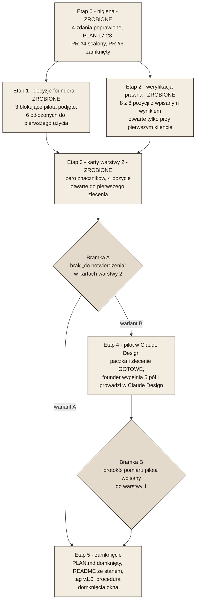

# Mapa drogowa domknięcia projektu

Stan na 2026-09-02 wieczorem, po scaleniu PR #4 i #8 oraz po trzech decyzjach foundera z tego dnia (wariant zamknięcia, dane firmy, porządek w PR-ach). Ten plik odpowiada na trzy pytania: co jest zrobione, co zostało, w jakiej kolejności to zamykać. Kolejka zadań pozostaje w `PLAN.md`; tutaj są etapy, bramki i zależności między nimi.

## Skąd wiadomo, że projekt jest gotowy

Repozytorium nie definiuje wprost, co znaczy „projekt zamknięty”. Z `CLAUDE.md` wynika, że repozytorium przechowuje treść i wytyczne, a kompozycja powstaje w Claude Design. Możliwe są więc dwa odczyty gotowości:

| Wariant | Co znaczy „gotowe” | Czego wymaga ponad stan obecny |
|---|---|---|
| **A. Repozytorium gotowe do użycia** | Trzy warstwy kompletne i spójne, żadna karta nie zawiera pozycji „do potwierdzenia przez foundera”, każde ustalenie prawne ma źródło pierwotne albo jawny status niesprawdzone. | Etapy 0-3 poniżej. |
| **B. Repozytorium sprawdzone w boju** | To, co w A, plus co najmniej jeden dokument przeprowadzony przez pełną ścieżkę: paczka wg `format-paczki.md`, prompt bazowy, wynik z Claude Design, wnioski wpisane z powrotem do warstwy 1. | Etapy 0-4 poniżej. |

**Decyzja foundera (2026-09-02): wariant B z jednym dokumentem pilotażowym.** Powód, który da się obalić: cztery specyfikacje identyfikacji mają wpisane falsyfikatory, których nie sprawdzi żaden przegląd plików, tylko realny dokument (polskie znaki na wagach 500 i 600, Karmin obok Aksamitu na papierze, sześć kolumn po 25 mm z realną treścią, H3 obok leadu). Zamknięcie bez pilota zostawia te cztery pozycje otwarte na zawsze. Jeżeli founder uzna, że pilot należy już do „użytkowania”, a nie do „budowy”, wariant A jest domknięciem poprawnym i o jeden etap krótszym.

## Co jest zrobione

| Warstwa | Zrealizowane | Dowód |
|---|---|---|
| 1 - baza wiedzy | Firma (2 pliki), prawo (6 plików: KFS, BUR, PSF, pożyczki UE/BGK plus dwa materiały źródłowe), usługi (2 pliki), szablon karty produktu, indeks. | `01-baza-wiedzy/00-INDEX.md` odsyła do każdego z nich. |
| 1 - identyfikacja | Paleta 14 kolorów „Kaszmir Wyciszony”, siatka A4, typografia z H3, logotyp z czterema zakazami. Wszystkie cztery zatwierdzone przez foundera. Tokeny maszynowe w jednym JSON. | `01-baza-wiedzy/identyfikacja/`, decyzje w `PLAN.md`, sekcja „Decyzje foundera - rozstrzygnięte”. |
| 2 - szablony | Siedem kart specyfikacji: viewbook, karta usługi BUR, certyfikat, papier firmowy i wizytówka, materiał sprzedażowy, program szkolenia, prezentacja sprzedażowa. Każda rozróżnia trzy kategorie elementów. | Pomiar w tej sesji: w każdym z siedmiu plików występują wszystkie trzy hasła („prawnie obowiązkowe”, „konwencja”, „swobodny wybór”). |
| 3 - pakiet | Format paczki z siedmioma zasadami użycia, prompt bazowy odsyłający do warstw 1 i 2, historia decyzji o palecie i siatce. | `03-pakiet-claude-design/`. |
| Zadania z `PLAN.md` | 16 z 16 pierwotnych zadań ma plik docelowy; zadania 17-23 odwzorowują etapy tej mapy, 17 i 18 zrealizowane. | Lista w `PLAN.md`, sekcja „Domknięcie projektu”. |

## Co zostało

Cztery grupy pracy, różne co do tego, kto je może wykonać.

### Grupa I - higiena repozytorium (zrealizowana 2026-09-02, PR #9)

1. Cztery zdania, które opisywały stan nieaktualny, poprawione:
   - `01-baza-wiedzy/00-INDEX.md`, wiersz o siatce: „jedną otwartą rozbieżnością co do jednostki bazowej 6 mm”, a `siatka-a4.md` ma tę sprawę rozstrzygniętą.
   - `01-baza-wiedzy/README.md`: „na razie paletę barw”, a w `identyfikacja/` są cztery specyfikacje.
   - `PLAN.md`, zadanie 15: „paleta 12 kolorów (...) wpisane do `format-paczki.md`”, a obowiązuje 14 kolorów w warstwie 1 i `format-paczki.md` już palety nie zawiera.
   - `PLAN.md`, wiersz „Paleta barw (12 kolorów, Colorbook Kaszmir Aksamit) (...) Specyfikacja: `format-paczki.md`”: ta sama nieaktualność co wyżej.
2. `PLAN.md` dostał zadania 17-23 odwzorowujące etapy tej mapy.
3. PR-y i gałęzie: rozstrzygnięte w grupie IV; zostało ręczne usunięcie dwóch gałęzi.

### Grupa II - decyzje foundera (blokują karty warstwy 2 i pilota)

Każda pozycja to jedno zdanie, z plikiem, który na nią czeka. Podział na to, co blokuje pilota, i to, co można odłożyć.

**Blokujące pilota (papier firmowy i wizytówka):**

| Decyzja | Stan | Czeka plik |
|---|---|---|
| Czy dane rejestrowe (KRS, NIP, REGON, adres) zostają w publicznym repozytorium. | **Rozstrzygnięte 2026-09-02: tak.** Dane wchodzą do paczki papieru firmowego. | Wpisane do `kontekst-firmy-sanitized.md`, `kontekst-firmy.md`, `PLAN.md`. |
| Forma prawna i siedziba IRIN. | **Rozstrzygnięte 2026-09-02:** sp. z o.o., siedziba w Kielcach. Sprzeczność między `kontekst-firmy.md` (brak danych, napis „Warszawa” z kanwy odrzucony) a `kontekst-firmy-sanitized.md` (sp. z o.o., Kielce, KRS) rozstrzygnięta na rzecz sanitized; jedna wersja w trzech plikach. | Wpisane do `kontekst-firmy.md` i `02-szablony-dokumentow/papier-firmowy.md`. |
| Czy papier firmowy zawiera e-mail, telefon i adres strony, a wizytówka ma format 85 × 55 mm, awers i rewers. | **Rozstrzygnięte 2026-09-02: tak, w całości jako konwencja IRIN.** | Wpisane do `02-szablony-dokumentow/papier-firmowy.md`. |
| Oznaczenie sądu rejestrowego i wysokość kapitału zakładowego (art. 206 KSH). | **Odczytane 2026-09-03 z rejestru KRS**, nie było decyzją: Sąd Rejonowy w Kielcach, X Wydział Gospodarczy KRS; 40 000,00 zł. Founder potwierdza przy zleceniu, bo kwota zmienia się wpisem. | Wpisane do `kontekst-firmy-sanitized.md`, `02-szablony-dokumentow/papier-firmowy.md` i do zlecenia pilota. |

Dwie pozycje wymagane przez art. 206 KSH (oznaczenie sądu rejestrowego, wysokość kapitału zakładowego) były opisane jako dane, które founder odczyta z KRS przy zleceniu pilota. **Odczytano je 2026-09-03 wprost z rejestru** - patrz wiersz wyżej; to były dane wejściowe, nie decyzja, więc nie wymagały czekania na foundera.

**Do odłożenia, aż powstanie dokument, którego dotyczą:**

| Decyzja | Czeka plik |
|---|---|
| Czy viewbook wychodzi osobno per dziedzina (Pedagogika, Akademia AI, Pożyczki UE/BGK) i w cyklu rocznym. | `02-szablony-dokumentow/viewbook.md`, `karta-uslugi-bur.md` |
| Czy certyfikat ma dwie wersje wdrożeniowe (kolumnowa, z pieczęcią) i regułę doboru wg kanału dystrybucji. | `02-szablony-dokumentow/certyfikat.md` |
| Model organizacyjny i historia firmy. | `01-baza-wiedzy/firma/kontekst-firmy.md` |
| Aplikacja sprzedażowa: platforma (web, mobile) i stan wdrożenia. | `01-baza-wiedzy/uslugi/aplikacje-sprzedazowe.md`, `02-szablony-dokumentow/material-sprzedazowy.md` |
| Portal szkoleń: nazwa, termin, technologia webinarów, model cenowy. | `01-baza-wiedzy/uslugi/portal-szkolen.md` |
| Minimalny rozmiar samodzielnego sygnetu (10 mm / 44 px) i kontrast znaku na akcentach dziedzinowych 4,5:1. | `01-baza-wiedzy/identyfikacja/logotyp.md` (plik sam odkłada to do pierwszego użycia sygnetu) |

### Grupa III - weryfikacja prawna u źródła pierwotnego

Ustalenia prawne w warstwie 1 powstawały ze źródeł wtórnych, bo w sesjach, w których je spisywano, dostęp do domen PARP i Dziennika Ustaw był zablokowany. Każda pozycja ma wpisany falsyfikator; zamknięcie oznacza odczyt dokumentu i wpisanie wyniku. **Lista, z adresami, sposobem przekazania i statusem każdej pozycji: `01-baza-wiedzy/prawo/weryfikacja-u-zrodla.md`.** Tabela niżej to skrót.

**Stan na 2026-09-03: wszystkie osiem pozycji ma wpisany wynik — siedem odczytanych u źródła, jedna (nr 6) w części.**

- **Pozycje 1-3 (BUR), 2026-09-02.** Founder dostarczył sześć plików PDF ze strony PARP (Regulamin BUR oraz Załączniki 1, 2g, 3, 4, 5); leżą w `01-baza-wiedzy/prawo/zrodla/`. Zamknęły wszystkie pozycje blokujące dwie karty warstwy 2. Odczyt obalił przy okazji założenie tej mapy: **Załącznika nr 12 z wzorem zaświadczenia już nie ma** - § 23 Regulaminu w wersji od 5 maja 2026 r. wymienia wyłącznie Załączniki 1-5, a wymogi zaświadczenia stoją dziś w Załączniku 4, Rozdział 2, pkt 3.
- **Pozycje 4-5 (KFS), 2026-09-03.** Rozporządzenie o KFS i ustawa o rynku pracy pobrane wprost z Dziennika Ustaw, razem z ustawą o PARP potrzebną do identyfikacji rejestru z art. 128 ust. 2. `kfs.md` stoi dziś na tekstach aktów, nie na materiale wtórnym.
- **Pozycja 6 (karta usługi we wniosku KFS), 2026-09-03, w części.** Poziom krajowy rozstrzygnięty przecząco: rozporządzenie o KFS wylicza zamkniętą listę elementów wniosku, karta usługi w niej nie występuje. Zostaje regulamin naboru konkretnego urzędu pracy.
- **Pozycja 7 (operator PSF), 2026-09-03.** Regulamin WUP w Kielcach przeczytany: bez akredytacji regionalnej i bez listy uznanych realizatorów, ale z czterema obowiązkami ponad wpis do BUR. Ważne dla jednego województwa; inny region wymaga powtórzenia pomiaru.
- **Pozycja 8 (znak Funduszy Europejskich), 2026-09-03.** Rozstrzygnięta mocniej, niż pytano: IRIN jako doradca zewnętrzny nie tylko nie musi używać znaku FE, ale nie ma prawa znaleźć się w cudzym zestawieniu znaków. Weszło do `format-paczki.md` jako siódma zasada.

**Założenie tej mapy, które upadło: blokada sieciowa nie jest własnością projektu.** Pomiar z 2026-09-03 na maszynie foundera: wszystkie sześć domen, które w sesjach z 2026-09-02 odpowiadały `connect_rejected`, zwracają 200 albo 302. Blokada dotyczyła środowiska w piaskownicy, nie każdego uruchomienia Claude Code w tym projekcie. Wniosek operacyjny: **zanim poprosisz foundera o dokument, zmierz dostęp z maszyny, na której właśnie pracujesz.**

| Co sprawdzić | Dokument źródłowy | Który plik czeka | Stan |
|---|---|---|---|
| Lista obowiązkowych pól karty usługi. | Regulamin BUR, Załącznik nr 2g (usługa szkoleniowa), wersja od 6 lipca 2026 | `prawo/bur.md`, `02-szablony-dokumentow/karta-uslugi-bur.md` | **odczytane u źródła** 2026-09-02 |
| Pola zaświadczenia o ukończeniu usługi. | Załącznik 4 „Zasady funkcjonowania Dostawców Usług”, Rozdział 2 pkt 3, wersja od 31 marca 2026 (nie Załącznik nr 12 - ten już nie istnieje) | `prawo/bur.md`, `02-szablony-dokumentow/certyfikat.md` | **odczytane u źródła** 2026-09-02 |
| Format kodu usługi (`2025/00817/PPUR` z kanwy to obserwacja, nie wymóg). | Regulamin BUR i Załącznik 4 | `prawo/bur.md` | **odczytane u źródła** 2026-09-02: żaden z sześciu dokumentów nie definiuje struktury numeru, więc karta ma wstawiać numer nadany przez system, bez rekonstrukcji |
| Treść rozporządzenia o KFS z 25 listopada 2025 oraz przepis z procentami. | Dz.U. 2025 poz. 1641 i Dz.U. 2025 poz. 620 (ustawa), plus Dz.U. 2025 poz. 98 (identyfikacja rejestru) | `prawo/kfs.md`, `prawo/kontekst-kfs-sanitized.md` | **odczytane u źródła** 2026-09-03: procenty i krotności w art. 126 ust. 1-3 ustawy, wymóg wpisu do BUR w art. 128 ust. 2, krąg osób w art. 125 ust. 10; rozporządzenie żadnych liczb nie zawiera |
| Czy operatorzy regionalni PSF nakładają na dostawcę kryteria ponad wpis do BUR. | Regulamin wsparcia operatora; **korekta 2026-09-03**: operatorem w świętokrzyskiem jest najpewniej WUP w Kielcach, nie ŚCITT - trop z wyszukiwarki, nie odczyt | `prawo/psf.md`, `prawo/bur.md` | niesprawdzone - do odczytu przy pierwszym kliencie z regionu |
| Czy karta usługi w BUR jest wymagana na etapie wniosku KFS. | Rozporządzenie o KFS § 2 (poziom krajowy) plus regulamin naboru konkretnego urzędu pracy | `prawo/kontekst-kfs-sanitized.md` | **odczytane u źródła w części** 2026-09-03: przepisy krajowe karty usługi nie wymagają; zostaje regulamin urzędu |
| Kto jest objęty obowiązkiem stosowania znaku FE: beneficjent, realizator, doradca zewnętrzny. | **Korekta 2026-09-03**: rozstrzyga Podręcznik wnioskodawcy i beneficjenta w zakresie informacji i promocji (od 20 maja 2026), nie Księga Tożsamości Wizualnej - Księga opisuje konstrukcję znaku | `prawo/pozyczki-ue-bgk.md`; tylko jeśli IRIN zechce użyć znaku FE | niesprawdzone - pozycja warunkowa |

Jeśli dostęp do tych domen nadal będzie zablokowany, dokumenty musi dostarczyć founder (PDF do repozytorium albo wklejony fragment). To jedyna grupa, której Claude Code nie domknie samodzielnie bez zmiany dostępu sieciowego.

### Grupa IV - porządek w gałęziach i PR-ach

| Pozycja | Stan zmierzony w tej sesji | Rekomendacja |
|---|---|---|
| PR #4 „finalize post-merge follow-ups” (`chore/post-merge-followups-psf-bur-kontekst`) | 1 commit, 3 pliki, scalenie bez konfliktów (sprawdzone `git merge-tree`). Rozstrzyga pośrednio wymóg wpisu dostawcy do BUR dla PSF i usuwa e-mail, telefon i adres strony z karty kontekstu firmy. | **Scalony 2026-09-02** za zgodą foundera. |
| PR #6 „Siedem wariantów palety v2” (`claude/irin-color-palette-variants-dl9lge`) | Dodawał katalog `02-branding/` z siedmioma wariantami. Ta sama treść trafiła do `main` przez PR #5, w katalogu `_robocze/paleta-v2/`. | **Zamknięty bez scalenia 2026-09-02** jako zastąpiony. |
| Gałęzie `copilot/irin-brandbook-os`, `claude/irin-color-palette-variants-tjjnza`, po zamknięciu także `chore/post-merge-followups-psf-bur-kontekst` i `claude/irin-color-palette-variants-dl9lge` | 0 commitów przed `main` (dwie pierwsze), scalona albo zastąpiona (dwie kolejne). Founder zgodził się na usunięcie. | **Do usunięcia ręcznie w GitHubie** (zakładka Branches). Proxy sesji odrzuca `git push --delete`, próba z tej sesji nie przeszła. Odwracalne: gałąź da się przywrócić z lokalnej kopii albo z zakładki zamkniętego PR. |

## Etapy i bramki

Etapy 1 i 2 były niezależne; oba są zamknięte. Etap 2 domknięto 2026-09-03: wszystkie osiem pozycji ma wpisany wynik. Pomiar z 2026-09-02 wieczorem pokazał, że z sesji Claude Code cztery domeny (parp.gov.pl, uslugirozwojowe.parp.gov.pl, dziennikustaw.gov.pl, isap.sejm.gov.pl) zwracają błąd połączenia, więc pozostałe dokumenty też muszą przyjść od foundera albo polityka sieciowa środowiska musi je dopuścić. Etap 4 (pilot) nie zależy od etapu 2 i może ruszyć równolegle.

**Co zostało odblokowane:** obie karty warstwy 2, które czekały na Etap 2 (`karta-uslugi-bur.md`, `certyfikat.md`), mają dziś listy pól odczytane u źródła i nie mają już sekcji „Status weryfikacji” z zastrzeżeniem o niepobranym załączniku.

| Etap | Kto wykonuje | Warunek wyjścia (mierzalny) |
|---|---|---|
| 0 - higiena | Claude Code | **Spełnione 2026-09-02:** `grep` po czterech nieaktualnych zdaniach zwraca zero trafień; `PLAN.md` ma zadania 17-23; na GitHubie nie ma otwartego PR poza #9. Poza bramką zostało ręczne usunięcie gałęzi. |
| 1 - decyzje foundera | Founder, Claude Code wpisuje | **Spełnione 2026-09-02:** trzy decyzje blokujące pilota wpisane do `PLAN.md` w sekcji „rozstrzygnięte”; sprzeczność o siedzibę i formę prawną ma jedną wersję w trzech plikach. |
| 2 - weryfikacja prawna | Claude Code, gdy sieć na jego maszynie dopuszcza źródła; inaczej founder dostarcza dokumenty | **Spełnione 2026-09-03.** Każda z ośmiu pozycji ma wpisany wynik, czyli warunek wyjścia jest spełniony: 1-3 z sześciu PDF-ów PARP (2026-09-02), 4-5 z trzech aktów w Dzienniku Ustaw, 6 na poziomie krajowym, 7 z regulaminu WUP w Kielcach, 8 z Podręcznika informacji i promocji FE. Zero pozycji „do potwierdzenia przy dostępie do PARP” w `bur.md`, `kfs.md`, `psf.md`, `pozyczki-ue-bgk.md`, `kontekst-kfs-sanitized.md`, `karta-uslugi-bur.md` i `certyfikat.md`. Dwie sprawy zostają otwarte, obie związane z pierwszym realnym klientem, nie z repozytorium: regulamin naboru jego urzędu pracy i regulamin operatora PSF, jeśli będzie spoza świętokrzyskiego. |
| 3 - karty warstwy 2 | Claude Code | **Spełnione 2026-09-02:** `grep -i "do potwierdzenia przez foundera" 02-szablony-dokumentow/` zwraca zero trafień; cztery pozycje mają status „otwarte do pierwszego zlecenia” z nazwą dokumentu. Zastrzeżenia o niepobranych załącznikach BUR zdjęte 2026-09-02 wraz z odczytem pozycji 1-3 etapu 2. |
| 4 - pilot | Founder w Claude Design, Claude Code buduje paczkę i spisuje wnioski | Paczka gotowa (`03-pakiet-claude-design/zlecenia/pilot-papier-firmowy.md`); od 2026-09-03 do wypełnienia zostały trzy pola zamiast pięciu - sąd rejestrowy i kapitał zakładowy odczytano z rejestru KRS. Bramka: pięć pomiarów z protokołu (polskie znaki na wagach 400-600, siatka 25 mm z treścią, H3 obok leadu, sygnet na rewersie, dokument bez koloru dziedzinowego) ma wpisany wynik w plikach warstwy 1. **Korekta wobec pierwszej wersji tej mapy:** kontrastu Karminu obok Aksamitu ten pilot nie sprawdzi, bo papier firmowy nie ma stanu błędu; ten falsyfikator przechodzi na pierwszy dokument ze statusami (certyfikat albo karta usługi BUR) i nie blokuje bramki B. |
| 5 - zamknięcie | Claude Code, founder zatwierdza | `PLAN.md` bez pozycji otwartych, `README.md` podaje stan „gotowe do użycia” z datą, tag `v1.0` na `main`. |

## Dlaczego pilotem jest papier firmowy, a nie certyfikat

Papier firmowy i wizytówka wymagają wszystkich czterech specyfikacji identyfikacji (logotyp, paleta, siatka, typografia) i mają najmniej zależności prawnych: jedyny wymóg to komplet danych rejestrowych, który zależy od jednej decyzji foundera. Certyfikat i karta usługi BUR zależą od Załączników 2 i 12 Regulaminu BUR, których odczyt jest w grupie III i może się przeciągnąć. Falsyfikator tego wyboru: jeśli founder potrzebuje pilnie zaświadczenia KFS na najbliższe szkolenie, pilotem staje się certyfikat, a papier firmowy idzie jako drugi.

## Śledzenie w GitHub

Od 2026-09-02 wykonanie śledzą issues w repozytorium; decyzje i specyfikacja zostają w `PLAN.md` i w plikach warstw. Zasada podziału: **issue mówi, co jest do zrobienia i przez kogo, plik mówi, co zostało ustalone.** Treści się nie kopiuje, issue odsyła do pozycji w `PLAN.md` albo do pliku.

| Co | Gdzie w GitHubie |
|---|---|
| Etapy 0-3, zadania 1-19 (zrealizowane) | milestone „Etapy 0-3: budowa repozytorium”, zamknięty; issues #10-#28 zamknięte jako zapis historyczny |
| Etap 2, osiem dokumentów | milestone „Etap 2”, issue nadrzędny #29, podzadania #30-#37 |
| Etap 4, pilot | milestone „Etap 4”, issue nadrzędny #38, podzadania #39-#45 |
| Etap 5, zamknięcie | milestone „Etap 5”, issue nadrzędny #46, podzadania #47-#51 (w tym martwe gałęzie i falsyfikator Karmin obok Aksamitu) |
| Sześć decyzji odłożonych plus reguła kontrastu znaku | issue nadrzędny #52, podzadania #53-#59, bez milestone |

Etykiety: `warstwa-1`, `warstwa-2`, `warstwa-3` (której warstwy dotyczy praca) i `czeka-na-foundera` (nie ruszy bez decyzji albo danych od foundera). **Tablica Projects: https://github.com/users/lukasz-znojek/projects/5** (utworzona 2026-09-02, run nr 6 workflow; 31 otwartych issues dodanych, 0 błędów). Powstaje i jest zasilana przez workflow `.github/workflows/tablica-projects.yml`, bo Projects v2 działa wyłącznie przez GraphQL, a proxy sesji Claude Code przepuszcza z GitHuba tylko REST (pomiar 2026-09-02: mutacja `createProjectV2` odrzucona z komunikatem o dopuszczonym zestawie operacji; `gh` też się przez to nie przebije, a instalacja `gh` z apt jest w sesji zablokowana). Workflow uruchamia się na runnerze GitHuba: znajduje albo tworzy tablicę „IRIN Brandbook - mapa drogowa”, nadaje kolumnom polskie nazwy, dodaje wszystkie otwarte issues i potem każdy nowo otwarty. Jednorazowo founder tworzy token klasyczny z zakresami `project`, `read:org` i `read:discussion` (fine-grained nie obsługuje tablic na koncie osobistym; bez dwóch ostatnich `gh project` zgłasza brak zakresów) i wpisuje go jako sekret `PROJECTS_TOKEN`; instrukcja krok po kroku w nagłówku pliku workflow. Po dodaniu sekretu workflow może uruchomić Claude Code z sesji (narzędzie do uruchamiania Actions działa przez REST).

## Czego ta mapa nie rozstrzyga

- Czy repozytorium ma zostać publiczne. Od tego zależy decyzja o danych rejestrowych, nie odwrotnie.
- Czy `_robocze/copilot-v1/` (30 plików po angielsku) ma zostać w repozytorium jako archiwum, czy wyjść do osobnego archiwum poza nim. Nie blokuje żadnego etapu.
- Terminy. Etapy są ułożone wg zależności, nie wg kalendarza; czas etapu 1 zależy od foundera, etapu 2 od dostępu do dokumentów.
