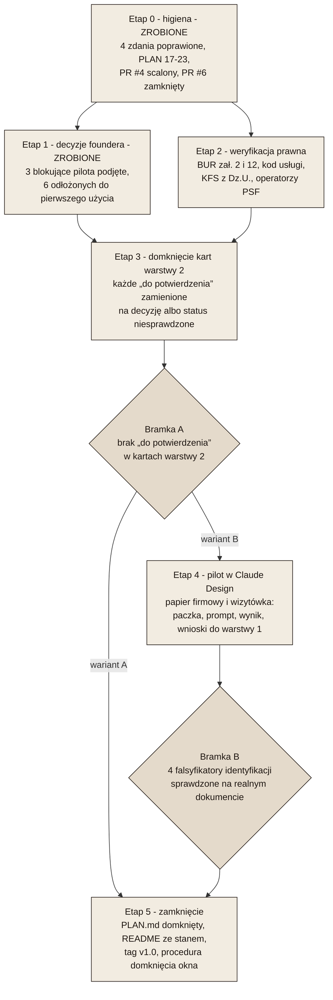

# Mapa drogowa domknięcia projektu

Stan na 2026-09-02 wieczorem, po scaleniu PR #4 i #8 oraz po trzech decyzjach foundera z tego dnia (wariant zamknięcia, dane firmy, porządek w PR-ach). Ten plik odpowiada na trzy pytania: co jest zrobione, co zostało, w jakiej kolejności to zamykać. Kolejka zadań pozostaje w `PLAN.md`; tutaj są etapy, bramki i zależności między nimi.

## Skąd wiadomo, że projekt jest gotowy

Repozytorium nie definiuje wprost, co znaczy „projekt zamknięty”. Z `CLAUDE.md` wynika, że repozytorium przechowuje treść i wytyczne, a kompozycja powstaje w Claude Design. Możliwe są więc dwa odczyty gotowości:

| Wariant | Co znaczy „gotowe” | Czego wymaga ponad stan obecny |
|---|---|---|
| **A. Repozytorium gotowe do użycia** | Trzy warstwy kompletne i spójne, żadna karta nie zawiera pozycji „do potwierdzenia przez foundera”, każde ustalenie prawne ma źródło pierwotne albo jawny status niesprawdzone. | Etapy 0-3 poniżej. |
| **B. Repozytorium sprawdzone w boju** | To, co w A, plus co najmniej jeden dokument przeprowadzony przez pełną ścieżkę: paczka wg `format-paczki.md`, prompt bazowy, wynik z Claude Design, wnioski wpisane z powrotem do warstwy 1. | Etapy 0-4 poniżej. |

**Decyzja foundera (2026-09-02): wariant B z jednym dokumentem pilotażowym.** Powód, który da się obalić: cztery specyfikacje identyfikacji mają wpisane falsyfikatory, których nie sprawdzi żaden przegląd plików, tylko realny dokument (polskie znaki na wagach 500 i 600, Karmin obok Aksamitu na papierze, sześć kolumn po 25 mm z realną treścią, H3 obok leadu). Zamknięcie bez pilota zostawia te cztery pozycje otwarte na zawsze. Jeżeli founder uzna, że pilot należy już do „użytkowania”, a nie do „budowy”, wariant A jest domknięciem poprawnym i o jeden etap krótszym.

## Co jest zrobione

| Warstwa | Zrealizowane | Dowód |
|---|---|---|
| 1 - baza wiedzy | Firma (2 pliki), prawo (6 plików: KFS, BUR, PSF, pożyczki UE/BGK plus dwa materiały źródłowe), usługi (2 pliki), szablon karty produktu, indeks. | `01-baza-wiedzy/00-INDEX.md` odsyła do każdego z nich. |
| 1 - identyfikacja | Paleta 14 kolorów „Kaszmir Wyciszony”, siatka A4, typografia z H3, logotyp z czterema zakazami. Wszystkie cztery zatwierdzone przez foundera. Tokeny maszynowe w jednym JSON. | `01-baza-wiedzy/identyfikacja/`, decyzje w `PLAN.md`, sekcja „Decyzje foundera - rozstrzygnięte”. |
| 2 - szablony | Siedem kart specyfikacji: viewbook, karta usługi BUR, certyfikat, papier firmowy i wizytówka, materiał sprzedażowy, program szkolenia, prezentacja sprzedażowa. Każda rozróżnia trzy kategorie elementów. | Pomiar w tej sesji: w każdym z siedmiu plików występują wszystkie trzy hasła („prawnie obowiązkowe”, „konwencja”, „swobodny wybór”). |
| 3 - pakiet | Format paczki z sześcioma zasadami użycia, prompt bazowy odsyłający do warstw 1 i 2, historia decyzji o palecie i siatce. | `03-pakiet-claude-design/`. |
| Zadania z `PLAN.md` | 16 z 16 pierwotnych zadań ma plik docelowy; zadania 17-23 odwzorowują etapy tej mapy, 17 i 18 zrealizowane. | Lista w `PLAN.md`, sekcja „Domknięcie projektu”. |

## Co zostało

Cztery grupy pracy, różne co do tego, kto je może wykonać.

### Grupa I - higiena repozytorium (zrealizowana 2026-09-02, PR #9)

1. Cztery zdania, które opisywały stan nieaktualny, poprawione:
   - `01-baza-wiedzy/00-INDEX.md`, wiersz o siatce: „jedną otwartą rozbieżnością co do jednostki bazowej 6 mm”, a `siatka-a4.md` ma tę sprawę rozstrzygniętą.
   - `01-baza-wiedzy/README.md`: „na razie paletę barw”, a w `identyfikacja/` są cztery specyfikacje.
   - `PLAN.md`, zadanie 15: „paleta 12 kolorów (...) wpisane do `format-paczki.md`”, a obowiązuje 14 kolorów w warstwie 1 i `format-paczki.md` już palety nie zawiera.
   - `PLAN.md`, wiersz „Paleta barw (12 kolorów, Colorbook Kaszmir Aksamit) (...) Specyfikacja: `format-paczki.md`”: ta sama nieaktualność co wyżej.
2. `PLAN.md` dostał zadania 17-23 odwzorowujące etapy tej mapy.
3. PR-y i gałęzie: rozstrzygnięte w grupie IV; zostało ręczne usunięcie dwóch gałęzi.

### Grupa II - decyzje foundera (blokują karty warstwy 2 i pilota)

Każda pozycja to jedno zdanie, z plikiem, który na nią czeka. Podział na to, co blokuje pilota, i to, co można odłożyć.

**Blokujące pilota (papier firmowy i wizytówka):**

| Decyzja | Stan | Czeka plik |
|---|---|---|
| Czy dane rejestrowe (KRS, NIP, REGON, adres) zostają w publicznym repozytorium. | **Rozstrzygnięte 2026-09-02: tak.** Dane wchodzą do paczki papieru firmowego. | Wpisane do `kontekst-firmy-sanitized.md`, `kontekst-firmy.md`, `PLAN.md`. |
| Forma prawna i siedziba IRIN. | **Rozstrzygnięte 2026-09-02:** sp. z o.o., siedziba w Kielcach. Sprzeczność między `kontekst-firmy.md` (brak danych, napis „Warszawa” z kanwy odrzucony) a `kontekst-firmy-sanitized.md` (sp. z o.o., Kielce, KRS) rozstrzygnięta na rzecz sanitized; jedna wersja w trzech plikach. | Wpisane do `kontekst-firmy.md` i `02-szablony-dokumentow/papier-firmowy.md`. |
| Czy papier firmowy zawiera e-mail, telefon i adres strony, a wizytówka ma format 85 × 55 mm, awers i rewers. | **Rozstrzygnięte 2026-09-02: tak, w całości jako konwencja IRIN.** | Wpisane do `02-szablony-dokumentow/papier-firmowy.md`. |

Dwie pozycje wymagane przez art. 206 KSH, których repozytorium nie zawiera (oznaczenie sądu rejestrowego, wysokość kapitału zakładowego), founder odczytuje z KRS przy zleceniu pilota; to dane wejściowe, nie decyzja.

**Do odłożenia, aż powstanie dokument, którego dotyczą:**

| Decyzja | Czeka plik |
|---|---|
| Czy viewbook wychodzi osobno per dziedzina (Pedagogika, Akademia AI, Pożyczki UE/BGK) i w cyklu rocznym. | `02-szablony-dokumentow/viewbook.md`, `karta-uslugi-bur.md` |
| Czy certyfikat ma dwie wersje wdrożeniowe (kolumnowa, z pieczęcią) i regułę doboru wg kanału dystrybucji. | `02-szablony-dokumentow/certyfikat.md` |
| Model organizacyjny i historia firmy. | `01-baza-wiedzy/firma/kontekst-firmy.md` |
| Aplikacja sprzedażowa: platforma (web, mobile) i stan wdrożenia. | `01-baza-wiedzy/uslugi/aplikacje-sprzedazowe.md`, `02-szablony-dokumentow/material-sprzedazowy.md` |
| Portal szkoleń: nazwa, termin, technologia webinarów, model cenowy. | `01-baza-wiedzy/uslugi/portal-szkolen.md` |
| Minimalny rozmiar samodzielnego sygnetu (10 mm / 44 px) i kontrast znaku na akcentach dziedzinowych 4,5:1. | `01-baza-wiedzy/identyfikacja/logotyp.md` (plik sam odkłada to do pierwszego użycia sygnetu) |

### Grupa III - weryfikacja prawna u źródła pierwotnego

Wszystkie ustalenia prawne w warstwie 1 pochodzą ze źródeł wtórnych, bo w sesjach, w których powstały, dostęp do domen PARP i Dziennika Ustaw był zablokowany. Każda pozycja ma wpisany falsyfikator; zamknięcie oznacza odczyt dokumentu i wpisanie wyniku.

| Co sprawdzić | Dokument źródłowy | Który plik czeka |
|---|---|---|
| Lista obowiązkowych pól karty usługi. | Regulamin BUR, Załącznik nr 2 | `prawo/bur.md`, `02-szablony-dokumentow/karta-uslugi-bur.md` |
| Pola zaświadczenia o ukończeniu usługi. | Regulamin BUR, Załącznik nr 12 | `prawo/bur.md`, `02-szablony-dokumentow/certyfikat.md` |
| Format kodu usługi (`2025/00817/PPUR` z kanwy to obserwacja, nie wymóg). | Regulamin BUR | `prawo/bur.md` |
| Treść rozporządzenia o KFS z 25 listopada 2025. | Dziennik Ustaw | `prawo/kfs.md` |
| Czy operatorzy regionalni PSF nakładają na dostawcę kryteria ponad wpis do BUR. | Regionalne „Zasady udzielania wsparcia” | `prawo/psf.md`, `prawo/bur.md` |
| Czy karta usługi w BUR jest wymagana na etapie wniosku KFS. | Regulamin konkretnego urzędu pracy | `prawo/kontekst-kfs-sanitized.md` |
| Rozdział beneficjent a doradca zewnętrzny w Księdze Tożsamości Wizualnej Funduszy Europejskich. | Księga Tożsamości Wizualnej FE | `prawo/pozyczki-ue-bgk.md`; tylko jeśli IRIN zechce użyć znaku FE |

Jeśli dostęp do tych domen nadal będzie zablokowany, dokumenty musi dostarczyć founder (PDF do repozytorium albo wklejony fragment). To jedyna grupa, której Claude Code nie domknie samodzielnie bez zmiany dostępu sieciowego.

### Grupa IV - porządek w gałęziach i PR-ach

| Pozycja | Stan zmierzony w tej sesji | Rekomendacja |
|---|---|---|
| PR #4 „finalize post-merge follow-ups” (`chore/post-merge-followups-psf-bur-kontekst`) | 1 commit, 3 pliki, scalenie bez konfliktów (sprawdzone `git merge-tree`). Rozstrzyga pośrednio wymóg wpisu dostawcy do BUR dla PSF i usuwa e-mail, telefon i adres strony z karty kontekstu firmy. | **Scalony 2026-09-02** za zgodą foundera. |
| PR #6 „Siedem wariantów palety v2” (`claude/irin-color-palette-variants-dl9lge`) | Dodawał katalog `02-branding/` z siedmioma wariantami. Ta sama treść trafiła do `main` przez PR #5, w katalogu `_robocze/paleta-v2/`. | **Zamknięty bez scalenia 2026-09-02** jako zastąpiony. |
| Gałęzie `copilot/irin-brandbook-os`, `claude/irin-color-palette-variants-tjjnza`, po zamknięciu także `chore/post-merge-followups-psf-bur-kontekst` i `claude/irin-color-palette-variants-dl9lge` | 0 commitów przed `main` (dwie pierwsze), scalona albo zastąpiona (dwie kolejne). Founder zgodził się na usunięcie. | **Do usunięcia ręcznie w GitHubie** (zakładka Branches). Proxy sesji odrzuca `git push --delete`, próba z tej sesji nie przeszła. Odwracalne: gałąź da się przywrócić z lokalnej kopii albo z zakładki zamkniętego PR. |

## Etapy i bramki

Etapy 1 i 2 były niezależne; etap 1 jest zamknięty. Etap 2 wymaga dostępu do dokumentów źródłowych: pomiar z 2026-09-02 wieczorem pokazał, że z sesji Claude Code cztery domeny (parp.gov.pl, uslugirozwojowe.parp.gov.pl, dziennikustaw.gov.pl, isap.sejm.gov.pl) zwracają błąd połączenia, więc dokumenty muszą przyjść od foundera albo polityka sieciowa środowiska musi je dopuścić. Etap 4 (pilot) nie zależy od etapu 2 i może ruszyć równolegle.

| Etap | Kto wykonuje | Warunek wyjścia (mierzalny) |
|---|---|---|
| 0 - higiena | Claude Code | **Spełnione 2026-09-02:** `grep` po czterech nieaktualnych zdaniach zwraca zero trafień; `PLAN.md` ma zadania 17-23; na GitHubie nie ma otwartego PR poza #9. Poza bramką zostało ręczne usunięcie gałęzi. |
| 1 - decyzje foundera | Founder, Claude Code wpisuje | **Spełnione 2026-09-02:** trzy decyzje blokujące pilota wpisane do `PLAN.md` w sekcji „rozstrzygnięte”; sprzeczność o siedzibę i formę prawną ma jedną wersję w trzech plikach. |
| 2 - weryfikacja prawna | Claude Code przy dostępie do PARP i Dz.U., inaczej founder dostarcza dokumenty | Każde z siedmiu ustaleń ma wpisane: odczytane u źródła albo status niesprawdzone z nazwanym powodem. Zero pozycji „do potwierdzenia przy dostępie do PARP”. |
| 3 - karty warstwy 2 | Claude Code | `grep -i "do potwierdzenia przez foundera" 02-szablony-dokumentow/` zwraca zero trafień; pozycje odłożone mają status „otwarte do pierwszego użycia” z nazwą dokumentu. |
| 4 - pilot | Founder w Claude Design, Claude Code buduje paczkę i spisuje wnioski | Cztery falsyfikatory z warstwy 1 (polskie znaki na 500 i 600, Karmin obok Aksamitu, siatka 25 mm z treścią, H3 obok leadu) mają wpisany wynik pomiaru w swoich plikach. |
| 5 - zamknięcie | Claude Code, founder zatwierdza | `PLAN.md` bez pozycji otwartych, `README.md` podaje stan „gotowe do użycia” z datą, tag `v1.0` na `main`. |

## Dlaczego pilotem jest papier firmowy, a nie certyfikat

Papier firmowy i wizytówka wymagają wszystkich czterech specyfikacji identyfikacji (logotyp, paleta, siatka, typografia) i mają najmniej zależności prawnych: jedyny wymóg to komplet danych rejestrowych, który zależy od jednej decyzji foundera. Certyfikat i karta usługi BUR zależą od Załączników 2 i 12 Regulaminu BUR, których odczyt jest w grupie III i może się przeciągnąć. Falsyfikator tego wyboru: jeśli founder potrzebuje pilnie zaświadczenia KFS na najbliższe szkolenie, pilotem staje się certyfikat, a papier firmowy idzie jako drugi.

## Czego ta mapa nie rozstrzyga

- Czy repozytorium ma zostać publiczne. Od tego zależy decyzja o danych rejestrowych, nie odwrotnie.
- Czy `_robocze/copilot-v1/` (30 plików po angielsku) ma zostać w repozytorium jako archiwum, czy wyjść do osobnego archiwum poza nim. Nie blokuje żadnego etapu.
- Terminy. Etapy są ułożone wg zależności, nie wg kalendarza; czas etapu 1 zależy od foundera, etapu 2 od dostępu do dokumentów.
